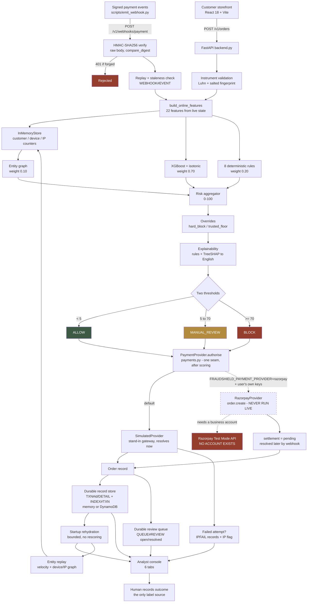
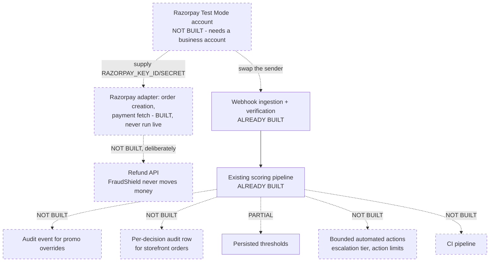

# FraudShield

## 1. One-Line Description

A defense-only transaction risk engine that scores every payment 0–100 from three independent evidence sources, explains the score in plain English, and routes it to allow, review, or block.

---

## 2. Problem We Solve

A merchant loses money two ways, and fixing one usually makes the other worse.

**Fraud gets through.** A stolen card buys a ₹20,000 phone. The payment authorises, the goods ship, and weeks later the real cardholder disputes it. The merchant loses the goods, the shipping, and a chargeback fee. Or one person opens five accounts on one device and claims a ₹500 welcome bonus five times — each account looks perfectly ordinary on its own.

**Or the detector overreacts.** Flag 20% of traffic to catch everything and you destroy more value than the fraud did. Declining a real customer costs lost margin now plus the expected value of them never returning. Sending that same transaction to a human for review costs a few minutes of analyst time.

In this repository's cost model those two errors differ by **41×** (`block_legit_cost` ₹1,438 vs `review_cost` ₹35, `ml/cost_model.py`). That single ratio drives every design decision here: when in doubt, route to a human rather than refuse the sale.

---

## 3. Solution

FraudShield scores each transaction with three layers that fail independently:

| Layer | Weight | What it contributes |
|---|---|---|
| XGBoost classifier | 0.70 | Learned weights over 22 engineered features, isotonically calibrated |
| Deterministic rules | 0.20 | 8 auditable thresholds, grouped so correlated rules cannot double-count |
| Entity graph | 0.10 | Accounts sharing devices and IPs — one account looks fine, the ring does not |

The weighted sum produces a 0–100 score. Two thresholds turn it into a decision: **ALLOW**, **MANUAL_REVIEW**, or **BLOCK**. Every score ships with reason codes drawn from the fired rules and the model's own per-row attributions.

A second, separate gate scores **promotion abuse** at redemption time rather than at checkout, because by the time a payment is scored the cashback is already credited.

---

## 4. Why This Matters

Recall alone is a vanity metric. A detector that flags a fifth of all traffic will catch nearly every fraud and still lose the merchant money, because each wrongly-declined customer costs roughly forty times what a review costs.

So this repository treats the decision as a **cost-minimisation problem**, not a classification problem:

- The block threshold is chosen where blocking is cheaper than being wrong.
- The review threshold is bounded by **analyst headcount**, not by model quality. At a 100:1 cost asymmetry the optimiser always wants to review more, so the binding constraint is how many people you employ — which is why it is a runtime control surface here, not a config constant.
- False-positive cost is reported as a first-class metric alongside precision and recall.
- The system never claims "this is fraud." It claims "this deserves attention, and here is the evidence." Ground truth is only created when a human records an outcome.

---

## 5. Hackathon Track

**Track 02 — AI Risk Manager.**

Scope is deliberately narrowed to **payment fraud and coordinated payment abuse**. Returns and chargebacks are recorded but not scored.

---

## 6. Current Implementation Status

Legend: ✅ COMPLETED · 🟡 PARTIAL · 🔴 NOT IMPLEMENTED · ⚪ UNVERIFIED

| Component | Status | Evidence | Missing |
|---|---|---|---|
| Synthetic dataset generator | ✅ | `ml/generate_dataset.py` (1,021 lines); `ml/data/transactions.csv` = 99,419 rows; `ml/data/metadata.json` | Real transaction data |
| Feature engineering (offline) | ✅ | `compute_features` in generator; 22 raw features in `metadata.json` | — |
| Feature engineering (online) | ✅ | `build_online_features` in `backend.py`; 22 features from live state | DynamoDB-backed counters |
| Offline/online parity test | ✅ | `tests/test_parity.py` — 99,419 rows × 22 features, passes | — |
| Train/validation/test split | ✅ | Temporal, by date; 69,593 / 14,913 / 14,913 = 70/15/15 | — |
| Model training | ✅ | `ml/train.py`; XGBoost 3.0.3, early-stopped at iteration 174 | — |
| Model artifact | ✅ | `ml/artifacts/model.json`, `calibrator.json`, `feature_spec.json` (trained 2026-08-23) | — |
| Probability calibration | ✅ | Isotonic, fit on validation only; Brier 0.00709 | — |
| Rule engine | ✅ | 8 rules with grouped scoring, `Scorer._rules` | — |
| Entity-graph / ring scoring | ✅ | `Scorer._network`; depth-2 expansion, 5 weighted terms | Persisted graph |
| Risk aggregation | ✅ | `W_ML 0.70 / W_RULES 0.20 / W_NETWORK 0.10` | — |
| Decision routing | 🟡 | ALLOW / MANUAL_REVIEW / BLOCK on two thresholds | 4-band LOW/MEDIUM/HIGH/CRITICAL not implemented |
| Explainability | ✅ | Fired rules + top-5 TreeSHAP contributions → templated English | — |
| Model evaluation | ✅ | `ml/evaluate.py`; `ml/artifacts/metrics.json` with sweep, baselines, fairness | F1 not reported |
| False-positive cost | ✅ | `ml/cost_model.py`; `false_positive_cost` in metrics | Costs are estimates, not audited |
| Promo-abuse gate | ✅ | `score_promo`, 5 rules; `ml/evaluate_promo.py`; `promo_metrics.json` | Small test split (898 rows) |
| Model-unavailable fallback | ✅ | `Scorer.__init__` degrades to rules+network at 0.70/0.30 | — |
| Threshold configuration | ✅ | `PUT /v1/admin/thresholds`, admin-only, audited, and **persisted** to `CONFIG/RISK_THRESHOLDS`; reloaded and validated at startup; invalid stored config falls back to env defaults and reports `degraded` on `/health`; 43 tests | Analyst review capacity is not a stored setting (§18) |
| Audit trail | ✅ | All 9 named events incl. `RISK_DECISION` (automatic), `OUTCOME_RECORDED` and `PROMO_OVERRIDE` (human ground truth), `NOTIFICATION_SENT`/`NOTIFICATION_FAILED` (communication), `MODEL_FALLBACK_TRIGGERED`; `GET /v1/admin/audit` with `?action=` filter; **Audit tab** in the console separating automated actions from human outcomes; 263 tests | Ranges capped at 31 days per request; filters unindexed |
| Analyst email alerts | ✅ | `notifications.py`: `EmailProvider` protocol, `ConsoleEmailProvider` (default, credential-free), `SMTPEmailProvider` with verified STARTTLS; alerts only on MANUAL_REVIEW / BLOCK / suspicious IP / promo hold; dedupe via `NOTIFICATION#<key>`; email failure cannot affect a risk decision; 109 tests | SMTP not verified against a live mail server |
| Bounded automated-action policy | ✅ | `ACTION_POLICY` + `NEVER_AUTOMATED` in `backend.py`, version-stamped, published read-only at `GET /v1/admin/policy` and recorded on every `RISK_DECISION`; 43 tests assert BLOCK creates no label, no refund, no threshold change | — |
| Fraud-ring estimated exposure | ✅ | `ring_exposure()`; gross / blocked / review / allowed / settled split, `confirmed_fraud_amount` null until a human labels; explicit retained-history window; 23 tests | Bounded by the retained transaction cache, not a fixed date range |
| REST API | ✅ | 31 routes in `backend.py`, verified by introspection | — |
| Authentication | ✅ | JWT access + httpOnly refresh, Argon2id, login rate limits | Email verification, password reset, MFA |
| Role-based authorisation | ✅ | `require_role` on every admin route; roles granted out-of-band | — |
| User / order persistence | 🟡 | `DynamoUserStore`, `DynamoRecordStore` | Opt-in only; no GSIs |
| Transaction store | ✅ | `TXN#<id>/DETAIL` + `INDEX#TXN` pointer; rehydrated at startup; 38 tests | History rehydration capped at 200 by default |
| Review queue | ✅ | `QUEUE#REVIEW/ITEM#<txn_id>` with open/resolved status; survives restart | — |
| Entity graph / counters | ✅ | Replayed from persisted transactions at startup; 38 tests assert every feature and sub-score is identical across a restart | Bounded to the most recent 5,000 transactions by default |
| Merchant dashboard | ✅ | 7-tab analyst console, React 18; Audit tab is admin-only | — |
| Customer storefront | ✅ | Shop, cart, payment sheet, orders, offers, dashboard | — |
| Webhook ingestion path | ✅ | `POST /v1/webhooks/payment`; provider event shape, paise conversion, method mapping | — |
| Webhook signature verification | ✅ | HMAC-SHA256 over raw body, `hmac.compare_digest`; 6 tests incl. forgery and tampering | — |
| Webhook replay protection | ✅ | `STATE["webhook_seen"]` + persisted `WEBHOOK#EVENT`; staleness window | — |
| Payment provider abstraction | ✅ | `payments.py`: `PaymentProvider` protocol, `SimulatedProvider`, `RazorpayProvider`; selected by `FRAUDSHIELD_PAYMENT_PROVIDER`; `create_order` no longer calls the simulator directly | — |
| Razorpay **adapter** (code) | ✅ | `payments.RazorpayProvider` — `order.create`, `payment.fetch`, paise conversion, status mapping, lazy SDK import, 78 tests against a mocked client | — |
| **Razorpay account + live API calls** | 🔴 | **No Razorpay business account, so no test-mode keys and no request has ever been sent to Razorpay.** The adapter is code that has never met the live API | A Razorpay account (user-supplied), then `pip install razorpay` and two env vars |
| Razorpay refund API | 🔴 | Deliberately not built — see §15 | FraudShield records return requests but never moves money |
| LLM explanations | 🔴 | No LLM dependency or call site | — |
| Automated test suite | ✅ | **545 pytest tests** (2 parity + 22 webhook + 21 risk audit + 38 outcome audit + 29 model fallback + 38 persistence + 38 entity rehydration + 38 promo persistence + 78 payment provider + 23 promo-override audit + 43 threshold persistence + 23 ring exposure + 43 action policy + 109 notifications) plus **51 frontend tests**; all pass | Load and performance tests |
| CI | ✅ | `.github/workflows/ci.yml` — pytest on 3.13, then `npm ci` + `npm run build` + `npm test`. No secrets, simulated provider, mocked Razorpay SDK, in-memory stores; a guard step fails the run if provider or AWS credentials are present | No deployment stage (deliberate) |
| Frontend tests | ✅ | 51 vitest tests: customer projection, role gating, BLOCK/MANUAL_REVIEW customer safety, provider chip accuracy, audit classification, notification projection and credential withholding | Not a full component suite; security-relevant behaviour only |
| Promo hold queue | ✅ | Rebuilt from persisted redemptions by status, not age; 38 tests incl. mixed open/resolved and repeated restarts | Promo override still emits no audit event |
| Containerisation | 🟡 | `Dockerfile` (serving only, non-root, healthcheck) | No compose, no frontend image |
| CI/CD | 🔴 | No `.github/`, no pipeline config | — |
| Secret hygiene | ✅ | `.env` gitignored and untracked; `.env.example` blanks all secrets | — |

---

## 7. Architecture

### As Implemented Today



Two things about that diagram are worth reading carefully.

**Solid lines are code that runs.** `PaymentProvider.authorise` is a real seam that every checkout now goes through, and `RazorpayProvider` is real code with 78 tests. Scoring happens *before* that call and does not depend on its result, so the provider cannot influence a decision.

**The dashed line into `Razorpay Test Mode API` has never carried a request.** There is no Razorpay account, so the box on the far right does not exist for this project. Everything up to it is built; the last hop is a credential the user must supply.

The webhook branch is the ingestion contract described in §15: verification, replay protection and scoring are real; the **sender** is a local emitter, not Razorpay.

### Target Architecture — What Remains



Note the direction of the remaining work on the provider: both halves of the code now exist — the receiving side (webhook) and the sending side (adapter) — so what remains is a Razorpay **account**, not a Razorpay **integration layer**.

---

## 8. Current Features

Only features with verified implementations are listed.

**Risk scoring**
- Three-layer scoring with independent failure modes, weights 0.70 / 0.20 / 0.10
- Isotonic-calibrated probabilities, so score × rupees is meaningful arithmetic
- Two overrides: `hard_block` (rules maxed and network > 85) and `trusted_floor` (established customer capped at 39)
- Exact offline/online parity, verified over 2,187,218 feature comparisons

**Explainability**
- Per-transaction reason codes from fired rules plus top-5 positive model attributions
- Reason codes stored on the transaction record, so an explanation survives a retrain
- Sub-scores broken out per layer, so an analyst can see which layer drove the decision

**Analyst console** (6 tabs)
- Risk-sorted review queue with an evidence panel
- Shared-entity graph, force-directed, with a screen-reader table equivalent
- Suspicious IPs with drill-down into individual declines
- Promo-abuse holds with analyst override
- Live model performance read from the evaluation artifacts
- Threshold tuner with a drawn cost curve, admin-only, audited

**Storefront**
- 12-product catalogue, persistent cart, multi-item orders
- Payment sheet with UPI / card / netbanking / wallet / COD, Luhn validation, network detection, simulated 3-D Secure step
- Failed attempts recorded; a burst from one address flags it
- Order history and return requests

**Payment provider**
- One authorisation seam (`PaymentProvider.authorise`) reached by every checkout, always **after** scoring, so a provider swap cannot change a decision
- `SimulatedProvider` — the default; delegates to the unchanged `simulate_authorisation`, resolves synchronously
- `RazorpayProvider` — order creation and payment fetch against the official SDK's documented surface, imported lazily. **Never executed against a live Razorpay account: none exists**
- Provider failures resolve to `pending`, never `success`; an `authorized` payment is `pending` too, because money held is not money taken
- Explicit `FRAUDSHIELD_PAYMENT_PROVIDER` switch; requesting Razorpay without credentials degrades to the simulator, warns at startup, and reports `degraded: true` on `/health`

**Security**
- JWT access tokens in memory only, refresh token in an httpOnly cookie
- Argon2id password hashing, weak-password rejection, login rate limits
- Server-derived IP hashing (HMAC) — a client cannot choose its own IP
- Card numbers fingerprinted then discarded, never stored
- Role enforced server-side on every admin route

---

## 9. ML Pipeline

```
ml/generate_dataset.py  →  transactions.csv (99,419 rows) + metadata.json
                                    ↓
ml/train.py             →  model.json, calibrator.json, feature_spec.json, train_report.json
                                    ↓
ml/evaluate.py          →  metrics.json
ml/evaluate_promo.py    →  promo_metrics.json
                                    ↓
backend.py Scorer       →  serves the artifact
tests/test_parity.py    →  proves online == offline
```

**Model.** XGBoost 3.0.3. `n_estimators=400`, `max_depth=5`, `learning_rate=0.05`, `subsample=0.8`, `colsample_bytree=0.8`, `min_child_weight=5`, `reg_lambda=1.5`, `eval_metric="aucpr"`, `early_stopping_rounds=40`. Early stopped at **iteration 174**. `scale_pos_weight` computed from class balance rather than SMOTE — synthetic oversampling on top of already-synthetic data compounds generator artefacts.

**Calibration.** Isotonic regression fit on the **validation split only**, saved as knots in `calibrator.json` and re-applied at serve time by interpolation. Raw XGBoost margins are not probabilities; the cost model multiplies probability by rupees, so uncalibrated scores would make that arithmetic meaningless.

**Feature matrix.** 22 named raw features expand to **27 model columns**: `payment_method` one-hot to 5 columns, `transaction_hour` to `hour_sin`/`hour_cos`.

**Leakage guard.** `assert_no_leakage` fails the run if any of 12 ID or outcome columns reach the matrix (`fraud_label`, `fraud_type`, `status`, `transaction_id`, `customer_id`, `device_fp`, `ip_hash`, `ts_epoch`, `timestamp`, `account_created_at`, `segment`, `split`).

**One notable design choice.** `ml/train.py` imports `build_matrix` and `RAW_FEATURES` **from `backend.py`**, inverting the usual direction. Serving code is canonical, so the transform cannot drift between training and inference — a bug class that produces plausible numbers and no error message.

---

## 10. Dataset

All figures below were measured directly from the CSV, not read from documentation.

| Property | Value |
|---|---|
| File | `ml/data/transactions.csv` |
| Total rows | **99,419** |
| Columns | 34 (22 features + labels, IDs, split) |
| Legitimate | **97,417** (97.99%) |
| Fraud | **2,002** (2.01%) |
| Duplicate rows | **0** |
| Missing values | 97,417 — all in `fraud_type`, which is null by definition on non-fraud rows |
| Distinct customers | 4,703 |
| Distinct devices | 12,480 |
| Distinct IPs | 4,421 |
| Time span | 180 days, ending 2026-06-30 |
| Generation | **Synthetic**, `ml/generate_dataset.py`, seed 20260822 |

**Split — temporal, by date boundary:**

| Split | Rows | Share | Fraud rate |
|---|---|---|---|
| Train | 69,593 | 70.0% | 1.868% |
| Validation | 14,913 | 15.0% | 2.414% |
| Test | 14,913 | 15.0% | 2.293% |

**Fraud archetypes:**

| Archetype | Rows |
|---|---|
| card_testing | 601 |
| account_takeover | 480 |
| ring_cashout | 421 |
| refund_abuse | 260 |
| first_party_abuse | 240 |

**Promo dataset:** `ml/data/promo_redemptions.csv`, 5,984 rows × 13 columns, 8.088% abuse.

### Is the generator realistic or simplistic?

Better than most synthetic generators, and it says so itself. `metadata.json` records self-audit figures the generator computes at build time:

- **No single feature separates the classes.** Highest single-feature AUC is `device_failure_rate` at 0.7672.
- **35.51% of fraud is not catchable by simple rules** (`fraud_indistinguishable_by_simple_rules`), so the ML layer has genuine work to do.
- `first_party_abuse` rows are **deliberately normal transactions**. They are undetectable at payment time by construction and cap achievable recall — which is why measured recall on that archetype is 0.000 rather than a bug.
- Features are computed in one chronological pass using only pre-event state, so no row can see its own outcome.
- The generator emits `warnings: []` when no feature separates too cleanly.

**Honest limitation:** it remains synthetic data written by the same author as the detector. Real performance will be worse, and `metrics.json` states this as its first caveat.

---

## 11. Fraud Detection Features

### Implemented — all 22 served online and verified at parity

| Group | Features |
|---|---|
| Transaction | `amount`, `payment_method`, `transaction_hour`, `is_weekend` |
| Velocity | `txn_count_10m`, `txn_count_1h`, `failed_count_10m`, `failed_count_1h` |
| Customer baseline | `account_age_hours`, `customer_avg_amount`, `amount_ratio`, `prev_txn_count`, `historical_failure_rate` |
| Device | `device_account_count`, `device_txn_count`, `device_failure_rate` |
| Network / IP | `ip_account_count`, `ip_txn_count` |
| Behavioural | `is_new_device`, `is_new_payment_method`, `seconds_since_last_txn`, `hour_deviation` |

### Specified but NOT implemented

- `transactions in 5 minutes` — only 10-minute and 1-hour windows exist
- `day of week` — reduced to the binary `is_weekend`
- `historical fraud rate per customer` — would leak the label; deliberately excluded
- `device historical risk` / `IP historical risk` as learned scores — only counts and failure rates exist
- `rapid payment-method switching` — computed as `methods_1h` and used by the **rule layer**, but it is not one of the 22 model features

### Fraud patterns, audited against the spec's list

| # | Pattern | Status | Mechanism |
|---|---|---|---|
| 1 | Payment velocity abuse | ✅ | `velocity_breach` rule (>5 in 10 min) + 4 velocity features |
| 2 | Device/account abuse | ✅ | `device_abuse` rule (>4 accounts) + graph layer |
| 3 | IP/account concentration | ✅ | `ip_concentration` rule (>6 accounts) + graph layer |
| 4 | Amount anomaly | ✅ | `amount_anomaly` rule (>4× baseline) + `amount_ratio` |
| 5 | Failed-payment spike | ✅ | `failure_spike` rule (>5/hour) + IP-burst flagging |
| 6 | New account risk | ✅ | `new_account` rule (<24h) + `account_age_hours` |
| 7 | New device risk | ✅ | `new_device` rule + `is_new_device` |
| 8 | Payment-method switching | ✅ | `method_switching` rule (>3 methods/hour) |
| 9 | Behavioural anomaly | ✅ | `hour_deviation`, `seconds_since_last_txn`, `amount_ratio` |
| 10 | Coordinated abuse ring | ✅ | `Scorer._network` graph expansion — see §14 |

---

## 12. Risk Scoring

**Aggregation.** `final = 0.70 × ml + 0.20 × rules + 0.10 × network`, clipped to 0–100.

Weights were not guessed. `metrics.json.aggregation_weight_search` records a sweep over five weightings on validation:

| Weights (ml/rules/net) | PR-AUC | Best cost |
|---|---|---|
| 1.00 / 0.00 / 0.00 | 0.8685 | ₹188,890 |
| 0.80 / 0.15 / 0.05 | 0.8653 | ₹187,475 |
| **0.70 / 0.20 / 0.10** | 0.8607 | ₹188,273 |
| 0.60 / 0.25 / 0.15 | 0.8541 | ₹214,133 |
| 0.50 / 0.30 / 0.20 | 0.8391 | — |

The chosen point is **not** the PR-AUC maximum. It trades ~0.008 PR-AUC for a rule layer that is auditable and works on day zero with no labels. That trade is documented rather than hidden.

**Rule layer — 8 rules, grouped.**

| Rule | Condition | Points | Group |
|---|---|---|---|
| `velocity_breach` | `txn_count_10m > 5` | 20 | velocity |
| `device_abuse` | `device_account_count > 4` | 15 | entity_sharing |
| `amount_anomaly` | `amount_ratio > 4` | 15 | amount |
| `ip_concentration` | `ip_account_count > 6` | 10 | entity_sharing |
| `failure_spike` | `failed_count_1h > 5` | 10 | velocity |
| `method_switching` | `methods_1h > 3` | 10 | velocity |
| `new_account` | `account_age_hours < 24` | 5 | novelty |
| `new_device` | `is_new_device == 1` | 5 | novelty |

Only the **highest-scoring rule per group** counts, and the layer is capped at 100. `device_abuse` and `ip_concentration` both measure "one actor, many accounts" — adding both punishes the same evidence twice. This is the structural fix for the additive blow-up in the hand-picked predecessor.

**Overrides.**
- `hard_block` — rules at 100 **and** network > 85 forces the score to 100.
- `trusted_floor` — account older than 180 days, >50 prior transactions, `amount_ratio < 2`, no rules fired → score capped at 39. Stops the model harassing the merchant's best customers over a new device.

**Decision bands — a deviation from spec.** The spec asks for four bands (LOW / MEDIIUM / HIGH / CRITICAL). The implementation has **three** decisions on two thresholds:

| Score | Decision |
|---|---|
| < 5 | ALLOW |
| 5 – 69.9 | MANUAL_REVIEW |
| ≥ 70 | BLOCK |

Thresholds default to 5 and 70, are overridable by `FRAUDSHIELD_REVIEW_T` / `FRAUDSHIELD_BLOCK_T`, and are adjustable at runtime by an admin. There is no separate MEDIUM "monitor" tier and no CRITICAL "escalate" tier — BLOCK is the terminal action.

### Threshold configuration is durable

**The bug this closed.** A threshold change used to live only on the `Scorer` instance. `PUT /v1/admin/thresholds` validated it, applied it, audited it — and the next restart discarded it. The audit trail then insisted an admin had tightened the block gate while the running service was back on the default. The log and the behaviour disagreed, which is worse than having no control at all.

Thresholds are now persisted through the **existing** single-table record store. No ORM, no new datastore, one item:

```
PK = CONFIG      SK = RISK_THRESHOLDS
{ review_threshold, block_threshold, updated_at, updated_by, version, reason }
```

| Property | Behaviour |
|---|---|
| Startup | Loaded and **validated** before the first request is served |
| Validation | `0 ≤ review < block ≤ 100`, NaN rejected. `review == block` is rejected because it would silently delete the human-review band |
| Same rule both ways | The endpoint and the startup loader share one validator, so a pair accepted at runtime cannot be refused on the next boot |
| No persisted config | Falls back to `FRAUDSHIELD_REVIEW_T` / `FRAUDSHIELD_BLOCK_T`. **Shipped defaults are unchanged: 5 and 70** |
| Invalid persisted config | Service still starts, logs `THRESHOLD CONFIGURATION DEGRADED`, serves env defaults, and reports `threshold_config.degraded: true` on `/health` and in the console |
| Write ordering | Persist **first**, apply second. A failed write returns 503 and leaves the running thresholds untouched, so the process and the table cannot drift |
| Authorisation | **Admin only** for the write; analyst may read. Unchanged |
| Audit | Every change emits `threshold_update` with before, after, actor, version and optional reason |
| History | The append-only audit partition, not a second copy in the config item — so there is one answer to "what changed when" |

The audited action name stays lower-case `threshold_update`, unlike the other event constants. That is deliberate: the spelling already exists in persisted audit partitions, and renaming it would orphan every historical record — a filter for the new name would silently return nothing for past changes, which is exactly the failure mode an audit trail must not have.

**Not persisted:** analyst review capacity. It is not a stored setting in this build — the capacity ceiling lives in the offline threshold sweep in `ml/evaluate.py`, not in runtime configuration — so there was nothing to make durable. Adding it would be a new setting, not a persistence fix.

---

## 12a. Bounded Automated-Action Policy

**Implemented, and deliberately a table rather than an agent.**

FraudShield is defense-only. It refuses payments and it queues them for people. It has no authority to conclude anything about a customer, and `ACTION_POLICY` in `backend.py` is the written form of that limit — deterministic, finite and version-stamped (`action-policy-1`), published read-only at `GET /v1/admin/policy`, and recorded on every `RISK_DECISION`.

| Decision | Automated action | Why |
|---|---|---|
| ALLOW | `PROCEED_TO_AUTHORISATION` | Score below the review threshold |
| MANUAL_REVIEW | `ENQUEUE_FOR_HUMAN_REVIEW` | Between the two thresholds |
| BLOCK | `REFUSE_BEFORE_AUTHORISATION` | At or above the block threshold. Refused **before** the provider is contacted, so there is no charge to reverse |

Every automated action record carries `action`, `reason`, `transaction_id`, `risk_score`, `at` and `policy_version`, plus explicit `creates_ground_truth: false`, `creates_fraud_label: false`, `moves_money: false`.

**Never done automatically** — published in the same response and asserted by tests:

confirm that a transaction was fraudulent · create or modify a ground-truth label · issue a refund or move money in any direction · ban, suspend, close or permanently restrict a customer account · change a risk threshold · change model weights or retrain the model · delete or alter evidence, audit records or stored transactions · notify a customer that they are suspected of fraud · share a decision with a third party

Two design points worth stating:

- **An unrecognised decision routes to a human, never through.** A band this build does not understand resolves to `ENQUEUE_FOR_HUMAN_REVIEW`, not to `PROCEED`.
- **The endpoint is read-only.** There is no runtime way to widen what the automation may do; that is a code change and a review. A test asserts `PUT`/`POST`/`PATCH`/`DELETE` on `/v1/admin/policy` all return 405.

This layer changed no behaviour. It names the behaviour that already existed so it can be audited and tested — and 43 tests now assert that a BLOCK creates no label, refunds nothing, bans nobody, moves no threshold, and deletes no evidence.

---

## 13. Explainability

**Implemented.** Two sources merged into one reason list, deduplicated, capped at 8 items:

1. **Fired rules** → templated English via `RULE_TEXT`, e.g. `"{txn_count_10m:.0f} attempts in 10 minutes"`. Severity `high` when the rule is worth ≥15 points.
2. **Model attributions** → top 5 features by absolute contribution, positive-only, mapped through `SHAP_TEXT`, tagged `source: "model"` with the numeric contribution attached.

**On the word SHAP.** The `shap` package is **deliberately not a dependency**. Attributions come from XGBoost's native `predict(..., pred_contribs=True)`, which is exact TreeSHAP computed inside the booster. Same values, no extra dependency, no sampling approximation. The code and `requirements-serve.txt` both say so explicitly.

**Not implemented:** no LLM anywhere in the repository. No `openai`, `anthropic`, `bedrock`, `langchain`, or any model API call. Explanations are template-based. This is a defensible choice for a fraud path — templates are deterministic, auditable and reproducible — but the spec's optional "structured evidence → LLM → prose" layer does not exist.

**Reproducibility.** Reason codes are stored on the transaction record, so an explanation can be re-read months later even after the model has been retrained.

---

## 14. Fraud Ring Detection

**Implemented.** `Scorer._network` in `backend.py` is a real graph computation, not a library import.

| Requirement | Status | Implementation |
|---|---|---|
| Graph creation | ✅ | Adjacency maintained live in `InMemoryStore.acct_devices` / `acct_ips` |
| Relationship extraction | ✅ | Account ↔ device and account ↔ IP edges on every commit |
| Connected components | ✅ | Seeded expansion from device + IP, conditional depth-2 hop |
| Suspicious cluster detection | ✅ | Requires ≥3 accounts; below that returns 0.0 |
| Cluster risk score | ✅ | 5 weighted terms: size 0.30, density 0.25, burst 0.20, failure rate 0.15, sync 0.10 |
| Graph visualisation | ✅ | `web/src/pages/RingView.tsx` — hand-rolled force-directed SVG, no charting library |
| Estimated exposure | ✅ | `ring_exposure()`; summed from persisted transaction amounts, split by decision. See below |

**Two guards worth noting.** Expansion is bounded at `MAX_COMPONENT = 200` because carrier CGNAT ranges reach thousands of accounts. And when the *only* link between accounts is a high-population IP (>25 accounts) with a device shared by ≤2, the score is damped to 35% — described in the code as the most expensive false-positive source found in testing.

### Estimated exposure — and what it is emphatically not

`GET /v1/admin/rings/{type}/{id}` now returns an `exposure` block, and the console prints **Estimated exposure: ₹X** above the graph.

> Estimated exposure is the sum of transaction amounts associated with accounts in this connected component, over the transactions FraudShield currently retains. It is **not** a loss estimate, **not** money confirmed stolen, and **not** a fraud verdict.

That sentence ships in the API response (`exposure.definition`) and is printed in the UI, not just written here — because an unqualified rupee figure sitting under a "fraud ring" heading reads as money stolen, and nothing in this system supports that claim.

| Field | Meaning |
|---|---|
| `gross_exposure` | Sum of all counted transaction amounts in the component |
| `blocked_amount` | Refused before authorisation. **No money moved on any of it** |
| `review_amount` | Sent to a human; the payment may or may not have settled |
| `allowed_amount` | Allowed through by the engine — ordinary revenue that happens to share a component |
| `settled_amount` | The subset that actually settled. The only slice where value changed hands |
| `confirmed_fraud_amount` | **`null` until a human labels something.** Never derived from BLOCK |
| `transactions_skipped` / `complete` | Records with unusable amounts are skipped and declared, so a partial figure announces itself |
| `window` | The retained transaction cache, **not** a date range |

Three deliberate refusals, each with a test:

- **`confirmed_fraud_amount` is `null`, not `0`, when nobody has ruled.** Zero would read as "reviewed and found clean". Deriving it from `BLOCK` would be the `BLOCK == FRAUD` inference this system exists to avoid.
- **The window is described, not invented.** It is bounded by `FRAUDSHIELD_REHYDRATE_TXNS` (default 200 recent transactions after a restart, plus everything scored since), so calling it "the last 30 days" would be a fabrication.
- **A truncated component reports `complete: false`.** When the walk hits `MAX_COMPONENT`, accounts are dropped, so the figure is a floor rather than a total — and the UI says so.

The figure is stable across a restart, because it is computed from the same rehydrated transaction cache the queue is.

**Honest caveat**, quoted from `metrics.json`: *"Ring detection is partly evaluated against its own generator's assumptions — the least transferable figure here."* Measured `network_only` PR-AUC is 0.1743, so the graph is a weak standalone ranker; it earns its 0.10 weight as corroboration, not as a detector.

---

## 15. Payment Provider Integration

**🟡 PARTIAL — both halves of the integration code exist and are tested. No Razorpay account exists, so nothing here has ever called Razorpay.**

Razorpay Test Mode requires a business account, which this project does not have. Two dishonest options were available: fake an integration, or claim the requirement is out of scope. Neither was taken. Instead:

- the **receiving** half (webhook ingestion, signature verification, replay protection) is implemented against Razorpay's documented shape, with a local emitter standing in for their sender
- the **sending** half (`payments.RazorpayProvider`) is implemented against the official SDK's documented surface, and tested against a mocked client
- the **account** is not implemented, because it cannot be by anyone but the user

Being precise about that boundary matters more here than anywhere else in this document, so it gets two explicit lists.

### IMPLEMENTED — code in this repository that runs

**Provider abstraction** (`payments.py`, 78 tests in `tests/test_payment_provider.py`):

| Capability | Evidence |
|---|---|
| `PaymentProvider` protocol | `is_configured` / `authorise` / `fetch_payment`. Deliberately no `refund` — see below |
| One authorisation seam | `create_order` calls `STATE["payment_provider"].authorise(...)`, never a gateway directly. Scoring runs **before** it and does not consume its result, so a provider swap cannot move a decision |
| `SimulatedProvider` | The existing stand-in, moved behind the interface. **Delegates** to `backend.simulate_authorisation` rather than copying it, so the decline model still has exactly one implementation |
| `RazorpayProvider.authorise` | Builds `{amount, currency: INR, receipt, notes}` and calls `client.order.create`. Amount converted to paise with rounding, not truncation |
| `RazorpayProvider.fetch_payment` | Calls `client.payment.fetch` and normalises the result for reconciliation |
| Lazy SDK import | `import razorpay` happens on first use, mirroring the lazy `boto3` import in `DynamoUserStore`. The default simulated path needs no Razorpay dependency at all |
| Single status table | `RAZORPAY_PAYMENT_STATUS`, `RAZORPAY_EVENT_STATUS` and `RAZORPAY_METHOD` live in one module. `backend.WEBHOOK_METHOD_MAP` is now an alias to that table, not a second copy |
| **No provider failure can report success** | Timeout, connection error, 4xx, 5xx, malformed body, missing credentials and missing SDK all yield `pending` with an operator-facing `error`. Tested for each case |
| **`authorized` is `pending`, not `success`** | Money held is not money taken. If auto-capture later failed, a `success` here would already have been recorded as a completed sale |
| BLOCK never reaches the provider | A refused sale creates no provider order. Tested that `order.create` is not called |
| Explicit provider selection | `FRAUDSHIELD_PAYMENT_PROVIDER`. Credentials alone never switch providers — a key left in a shell profile must not silently redirect live checkout traffic |
| Graceful degradation | `razorpay` requested without keys ⇒ falls back to the simulator, logs a `DEGRADED` warning, and reports `degraded: true` on `/health`. It does not crash startup and does not fail every checkout |
| Separate identifiers | `provider`, `provider_order_id`, `provider_payment_id` are stored **alongside** `order_id` / `transaction_id`, never in place of them |
| Errors are analyst-only | `provider_error` is on the record and in the staff-only `risk` block. Tested that neither the exception text nor the provider name reaches a customer response |
| No key material in observability | `/health` publishes mode names and booleans. Tested that neither the key id nor the secret appears anywhere in it |

**Webhook ingestion** (unchanged by this work, 22 tests):

| Capability | Evidence |
|---|---|
| Webhook endpoint | `POST /v1/webhooks/payment` (`backend.py` §12) |
| **HMAC-SHA256 signature verification** | `verify_webhook_signature()` — digest over the **raw request body**, compared with `hmac.compare_digest` |
| Forged signature rejected | 401. Tested: wrong signature, wrong secret, absent, empty, and tampered body with a valid original signature |
| Fail-closed when unconfigured | 503 if `FRAUDSHIELD_WEBHOOK_SECRET` is unset — never accepts unverified events |
| Replay / idempotency | Event id checked against memory + persisted `WEBHOOK#EVENT`; tested that a redelivery does not double-count velocity |
| Staleness window | Events older than `WEBHOOK_MAX_AGE_S` (24h) rejected |
| Provider event shape | `payment.captured` / `payment.failed`, `payload.payment.entity`, `notes` |
| Paise → rupee conversion | `amount` arrives in paise; tested that 249900 becomes ₹2,499.00 |
| Method mapping | `emi` and `cardless_emi` → `card`, `cash` → `cod`, so no event is silently dropped |
| Customer resolution | Payer email matched to an account, else a **stable** pepper-derived pseudo-id |
| Scoring and persistence | Same `Scorer`, same record shapes, lands in the review queue |
| Failed-attempt + IP flagging | A decline burst arriving by webhook flags the address exactly as one at checkout does |
| Audit | Every ingestion writes `payment_event_ingested` |

Two implementation details that are load-bearing, both documented in the code:

- The digest is computed over the **exact bytes received**, not a re-serialised copy of the parsed JSON. Re-serialising changes key order and spacing, the signature stops matching, and the usual "fix" is to stop verifying.
- `hmac.compare_digest`, not `==`. A short-circuiting comparison leaks how many leading bytes matched, which is enough to forge a signature byte by byte.

### REQUIRES USER CREDENTIALS — not implemented, and not implementable here

| Missing | Why | What it would take |
|---|---|---|
| **A Razorpay account** | Test Mode requires a registered business account. This project has none | The user signs up; nobody else can do this step |
| **Test-mode keys** (`rzp_test_…`) | Follow from the account | Paste into `RAZORPAY_KEY_ID` / `RAZORPAY_KEY_SECRET` |
| **Any executed call to Razorpay** | No credentials ⇒ no request has ever been sent. `order.create` and `payment.fetch` have only ever run against a mock | Set the two variables and `FRAUDSHIELD_PAYMENT_PROVIDER=razorpay` |
| The `razorpay` SDK as a hard dependency | Commented out in `requirements-serve.txt` on purpose, since the default provider never needs it | `pip install razorpay==1.4.2` |
| Verification against Razorpay's **real** signatures | Only ever verified against our own emitter's HMAC. The algorithm matches their documentation, but "matches the docs" is not "matches their bytes" | Register the webhook URL in their dashboard and receive one real delivery |
| Confirmation that the payload shape is accepted | Field names come from Razorpay's published API reference, not from a 200 response | One live `order.create` |

**So: this is not "Razorpay integration works."** There is no Razorpay account, no credential, and no evidence of a single successful request to Razorpay. What exists is a complete, tested adapter on both sides of the boundary. The honest claim is: **ready for Razorpay Test Mode, pending an account.** Anything stronger than that would be a claim this repository cannot support.

### Running without Razorpay — the default

Nothing to configure. `FRAUDSHIELD_PAYMENT_PROVIDER` defaults to `simulated`.

```bash
uvicorn backend:app --port 8000 --forwarded-allow-ips=
```

Startup prints the mode:

```
payment provider: simulated (requested=simulated, razorpay_configured=False)
```

Behaviour is byte-for-byte what it was before the abstraction existed: `SimulatedProvider` delegates to `simulate_authorisation`, settlement resolves **synchronously and server-side** immediately after scoring, and a customer sees `confirmed`, `verifying`, `declined` or `declined_by_bank`. `settlement` is only ever `success` or `failed` — the simulator never produces `pending`, and a test asserts that over 200 authorisations.

This is the path used for every demo, every screenshot and 358 of the 436 tests.

### Running with Razorpay Test Mode — requires your own account

Only meaningful if you have a Razorpay account. Nothing in this repository can substitute for one.

```bash
pip install razorpay==1.4.2          # deliberately not in requirements-serve.txt
```

```env
FRAUDSHIELD_PAYMENT_PROVIDER=razorpay
RAZORPAY_KEY_ID=rzp_test_your_own_key
RAZORPAY_KEY_SECRET=your_own_secret
RAZORPAY_WEBHOOK_SECRET=your_dashboard_webhook_secret
```

Then restart. Startup states the mode and does not overstate it:

```
payment provider: razorpay (requested=razorpay, razorpay_configured=True)
NOTE: the Razorpay adapter has never been exercised against a live Razorpay
      account. Verify Test Mode end-to-end before trusting settlement values.
```

What changes, and what does not:

| | Simulated | Razorpay |
|---|---|---|
| Scoring | identical | identical |
| Weights, thresholds, rules, graph | identical | identical |
| When settlement is known | immediately | later, by webhook |
| `settlement` at order creation | `success` / `failed` | `pending` |
| Customer sees | `confirmed` / `declined_by_bank` | `verifying` |
| Outbound network call | none | `order.create` |
| `provider_order_id` | `null` | `order_…` from Razorpay |

Misconfiguration is safe by construction. Set `FRAUDSHIELD_PAYMENT_PROVIDER=razorpay` with no keys and you get:

```
payment provider: simulated (requested=razorpay, razorpay_configured=False)
WARNING: PAYMENT PROVIDER DEGRADED -- PAYMENT_PROVIDER=razorpay but
         RAZORPAY_KEY_ID / RAZORPAY_KEY_SECRET are unset. Falling back to
         the simulator.
```

`/health` reports the same thing (`payment_provider: "simulated"`, `degraded: true`), and the analyst console shows a `simulated gateway (degraded)` chip. The service keeps working; it just refuses to pretend.

**Also note:** `RAZORPAY_WEBHOOK_SECRET` is accepted as a *fallback source* for the webhook signing secret, because that is what Razorpay's dashboard calls it. `FRAUDSHIELD_WEBHOOK_SECRET` still wins where both are set, and with **neither** set the endpoint still returns 503 rather than accepting unverified events. This adds a way to supply the secret, not a way to skip the check.

### Why an unresolved payment is `pending`

A new settlement value was added, reluctantly. A real provider settles **asynchronously**: creating a Razorpay order tells you nothing about whether the customer will complete the payment, and the answer arrives later by webhook.

Reporting `success` at order-creation time would be exactly the failure this whole seam exists to prevent — claiming money that has not been taken. So an unresolved payment is `pending`, which maps onto the **existing** customer state `verifying`, which already means "we don't know yet, something will resolve this". No new customer-facing vocabulary, no new UI state.

Two consequences, both tested:

- a `pending` order shows `verifying`, never `confirmed`
- a `pending` order records **no failed attempt** and does not touch IP failure counters. Unresolved is not declined, and counting it as one would flag addresses over payments still in flight

### Refunds — deliberately not built

**The Razorpay refund API adapter is not exposed because FraudShield currently records return requests but does not execute refunds.**

`POST /v1/returns` writes `status: "under_review"` against the order and stops there. A repository-wide search finds no money-movement code on any path — the other matches for "refund" are dataset fields, documentation and frontend copy. So a `refund()` method on `PaymentProvider` would be an unused stub that made the interface look more capable than the product is, and would invite a future caller to move real money through a path that has never been designed, reviewed or audited.

If refunds are built later, the honest order of work is: decide who may authorise one, audit it as its own event, then add the adapter method — not the reverse.

### The simulator

`scripts/emit_webhook.py` signs payloads with the shared secret and posts them:

```bash
python scripts/emit_webhook.py                  # one successful payment
python scripts/emit_webhook.py --status failed  # one decline
python scripts/emit_webhook.py --burst 4        # card-testing burst, flags the IP
python scripts/emit_webhook.py --forge          # expect 401
python scripts/emit_webhook.py --replay         # expect the second to dedupe
python scripts/emit_webhook.py --demo           # all of the above in sequence
```

Verified output from a live `--demo` run:

```
1. valid signature, successful payment
  HTTP 200  accepted          score 2.8 -> ALLOW  pay_35406b3bb5
2. forged signature -- must be refused
  HTTP 401  forged            Invalid webhook signature.
3. replay of a valid event -- must be deduplicated
  HTTP 200  first delivery    score 2.9 -> ALLOW  pay_136fcdf904
  HTTP 200  redelivery        DUPLICATE -- replay refused, nothing scored
4. card-testing burst from one address (ip_sim_8ff7f326)
  HTTP 200  decline 1         score 41.5 -> MANUAL_REVIEW  pay_0819450846
  HTTP 200  decline 2         score 73.9 -> BLOCK  pay_2b39f1d4cf
  HTTP 200  decline 3         score 74.3 -> BLOCK  pay_91338fba56
  HTTP 200  decline 4         score 74.6 -> BLOCK  pay_66497a438c
```

The escalation is the engine responding in real time: velocity and failure features accumulate across the burst, and the address is flagged at the third decline.

### One honest modelling limitation

A webhook arrives from the **provider's servers**, not the payer's browser, so `device_fp` and `ip_hash` cannot be derived from the connection. The merchant must forward them in `notes` at order-creation time. When absent, the record is marked `signals_complete: false` and sentinel values keep the transaction out of real clusters rather than joining an arbitrary one — device and IP signals are *unavailable* for that transaction rather than wrong.

**What still exists for the storefront path.** `simulate_authorisation(method, amount, decision)` is unchanged and remains the default gateway for orders placed through `/v1/orders`, using per-method decline rates (card 6%, netbanking 5%, wallet 3%, UPI 2%, +3% above ₹25,000) and always failing a BLOCK. It is now reached *through* `SimulatedProvider`, which delegates to it rather than reimplementing it — so the arithmetic above still has exactly one definition and the simulator was not replaced.

---

## 16. API Documentation

31 routes, enumerated by introspecting `backend.app.routes`. All exist. All 13 `/v1/admin/*` routes enforce a role — verified programmatically, not by inspection.

### Authentication

| Method | Endpoint | Purpose | Guard | Status |
|---|---|---|---|---|
| POST | `/v1/auth/register` | Create a customer account | public | ✅ |
| POST | `/v1/auth/login` | Sign in, rate limited | public | ✅ |
| POST | `/v1/auth/refresh` | Exchange refresh cookie | public | ✅ |
| POST | `/v1/auth/logout` | Revoke refresh token | public | ✅ |
| GET | `/v1/auth/me` | Current user | session | ✅ |

### Storefront

| Method | Endpoint | Purpose | Guard | Status |
|---|---|---|---|---|
| GET | `/v1/catalog/products` | Catalogue, methods, banks, wallets | public | ✅ |
| POST | `/v1/orders` | Create + score + authorise an order | session | ✅ |
| GET | `/v1/orders` | Order list, role-projected | session | ✅ |
| GET | `/v1/orders/{order_id}` | Single order | session | ✅ |
| POST | `/v1/returns` | Request a return | session | ✅ |
| GET | `/v1/returns` | Return list | session | ✅ |
| GET | `/v1/promo/offers` | Available offers | public | ✅ |
| POST | `/v1/promo/redeem` | Claim, scored by the promo gate | session | ✅ |
| GET | `/v1/promo/mine` | Own redemptions | session | ✅ |

### Risk (service-to-service)

| Method | Endpoint | Purpose | Guard | Status |
|---|---|---|---|---|
| POST | `/v1/risk/score` | Score a transaction, full evidence | api-key | ✅ |
| POST | `/v1/checkout` | Score, customer-safe projection | api-key | ✅ |

### Analyst console

| Method | Endpoint | Purpose | Guard | Status |
|---|---|---|---|---|
| GET | `/v1/admin/queue` | Risk-sorted review queue | analyst, admin | ✅ |
| GET | `/v1/admin/transactions/{txn_id}` | Transaction detail + features | analyst, admin | ✅ |
| POST | `/v1/admin/transactions/{txn_id}/outcome` | Record ground truth | analyst, admin | ✅ |
| GET | `/v1/admin/rings/{entity_type}/{entity_id}` | Entity graph, depth 1–3 | analyst, admin | ✅ |
| GET | `/v1/admin/metrics` | Evaluation artifacts | analyst, admin | ✅ |
| GET | `/v1/admin/thresholds` | Current cut-offs + cost curve | analyst, admin | ✅ |
| PUT | `/v1/admin/thresholds` | Move cut-offs, audited | **admin only** | 🟡 not persisted |
| GET | `/v1/admin/audit` | Audit log; `?action=RISK_DECISION` filters by event type | **admin only** | ✅ |
| GET | `/v1/admin/promo-holds` | Held/denied claims | analyst, admin | ✅ |
| POST | `/v1/admin/promo-holds/{rid}/override` | Grant anyway, creates a label | analyst, admin | ✅ |
| GET | `/v1/admin/suspicious-ips` | Flagged addresses + evidence | analyst, admin | ✅ |
| GET | `/v1/admin/failed-attempts` | All stored declines | analyst, admin | ✅ |

### Ingestion

| Method | Endpoint | Purpose | Guard | Status |
|---|---|---|---|---|
| POST | `/v1/webhooks/payment` | Ingest a signed payment event, score and persist it | **HMAC signature** | ✅ |

Public and unauthenticated by design — a provider has no session and no API key, so the signature *is* the authentication. That is why a missing or wrong signature returns 401 rather than 400, and why the endpoint returns 503 rather than accepting anything when no secret is configured. Accepts `X-Razorpay-Signature` or `X-Webhook-Signature`.

### Operations

| Method | Endpoint | Purpose | Guard | Status |
|---|---|---|---|---|
| GET | `/health` | Model version, thresholds, store backends, rehydration completeness, **active payment provider**, **threshold config source** | public | ✅ |
| GET | `/v1/admin/policy` | The bounded automated-action policy, read-only | analyst/admin | ✅ |
| GET | `/v1/admin/notifications` | Analyst alert delivery history; `?status=` and `?event_type=` filters | analyst/admin | ✅ |

`/health` reports `payment_provider` (the gateway actually serving checkout), `razorpay_configured` (a boolean — credentials present, which is not the same as valid), and `payment_provider_status` with the requested mode, a `degraded` flag and a human-readable note. It publishes **no key material**; a test asserts that neither the key id nor the secret appears anywhere in the response.

---

## 17. Database Schema

Single-table design, DynamoDB-shaped (`PK` + `SK`). Two interchangeable implementations: `InMemoryRecordStore` (default) and `DynamoRecordStore` (opt-in via `FRAUDSHIELD_USERS_BACKEND=dynamodb`). There is **no ORM and no migration framework** — item shapes are written inline.

### Items actually written (verified from `records.put` call sites)

| PK | SK | Purpose | Status |
|---|---|---|---|
| `USER#<id>` | `PROFILE` | Account: email, Argon2id hash, role, created_at | ✅ |
| `EMAIL#<email>` | `USER` | Email-uniqueness index; conditional put | ✅ |
| `USER#<id>` | `RT#<tid>` | Refresh token, SHA-256 hashed, TTL | ✅ |
| `CUSTOMER#<id>` | `ORDER#<iso>#<order_id>` | Order + score + reason codes + `provider` / `provider_order_id` / `provider_payment_id` / `provider_error` | ✅ |
| `INDEX#ORDER` | `<order_id>` | Order → customer lookup | ✅ |
| `CUSTOMER#<id>` | `RETURN#<iso>#<id>` | Return request | ✅ |
| `CUSTOMER#<id>` | `PROMO#<code>#<iso>` | Redemption + gate decision | ✅ |
| `INDEX#PROMO` | `<rid>` | Redemption lookup, plus a hold-queue projection: `redemption_id`, immutable `decision`, and a best-effort `resolved` hint | ✅ |
| `INSTRUMENT#<ref>` | `<iso>#<customer>` | Instrument reuse across accounts | ✅ |
| `PROMODEV#<device>` | `<code>#<iso>#<customer>` | Promo-per-device counter | ✅ |
| `PROMOIP#<ip>` | `<code>#<iso>#<customer>` | Promo-per-IP counter | ✅ |
| `PAYOUT#<ref>` | `<code>#<iso>#<customer>` | Payout-destination reuse | ✅ |
| `CUSTOMER#<id>` | `FAILED#<iso>#<id>` | Failed payment attempt | ✅ |
| `IPFAIL#<ip>` | `ATTEMPT#<iso>#<id>` | Failed attempt by address | ✅ |
| `SUSPICIOUS#IP` | `<ip_hash>` | Flagged address | ✅ |
| `WEBHOOK#EVENT` | `<event_id>` | Ingested provider event; replay protection across restarts | ✅ |
| `AUDIT#<date>` | `<iso>#<event_id or uuid>` | Audit entry, including every `RISK_DECISION` | ✅ |
| `NOTIFICATION#<dedupe_key>` | `DELIVERY` | Analyst alert delivery state; deduplication across restarts. **Never holds a credential** | ✅ |

### Transaction and review-queue items

Added so the analyst console survives a restart. The record store is the **source of truth**; `STATE["txns"]` and `STATE["queue"]` are now a cache rebuilt at startup.

| PK | SK | Purpose | Status |
|---|---|---|---|
| `TXN#<transaction_id>` | `DETAIL` | Authoritative scored transaction: score, decision, sub-scores, reason codes, fired rules, model version, degraded flag, raw features, label | ✅ |
| `INDEX#TXN` | `<iso>#<transaction_id>` | Time-sorted index carrying a **replay projection**: `customer_id`, `amount`, `payment_method`, `device_fp`, `ip_hash`, `settlement`, `created_at`, `committed` | ✅ |
| `QUEUE#REVIEW` | `ITEM#<transaction_id>` | Queue membership plus `status` (`open` / `resolved`), risk score and decision | ✅ |

Two design notes worth stating:

**The queue SK is keyed on `transaction_id` alone**, not on time or risk. Resolving an item is then a direct `update_fields()` rather than a search for its sort key — and it costs nothing in ordering, because `/v1/admin/queue` has always sorted by `-risk_score` in Python. Encoding risk into the sort key would have made stored order authoritative and silently changed queue semantics.

**Resolution is a status flip, not a delete.** The record-store interface has no `delete`, and adding one would be a wider change than this needed. Rehydration loads only `status == "open"`, so `/v1/admin/queue` behaves exactly as the old `list.remove()` did, while the fact that an item was once queued survives.

**Provider identifiers are additive fields, not replacements.** `order_id` and `transaction_id` remain FraudShield's own and are unchanged. `provider_order_id` and `provider_payment_id` are recorded next to them, `null` under the simulator. Collapsing the two would make the stored model provider-shaped and unrecoverable if the provider ever changed. `provider_error` is written for operators and is excluded from `_customer_order_view`, which is an explicit allow-list, so a new field cannot leak to a customer by default.

### Startup rehydration

`rehydrate_state()` runs in `lifespan` before the app serves traffic:

1. one query on `INDEX#TXN`, newest first, take at most `FRAUDSHIELD_REHYDRATE_TXNS` ids (default 200)
2. one point-get per id for the authoritative `TXN#<id>/DETAIL`
3. one query on `QUEUE#REVIEW`, keeping only `status == "open"`

No scan, no new GSI — both access patterns fall out of the primary key design, so adding an index would cost money and buy nothing. The history cap bounds startup cost; **open review items are never capped**, because an unreviewed item is exactly what must not be dropped. If a queued transaction falls outside the history window it is loaded individually.

Reloading never re-scores and emits no `RISK_DECISION`: the stored decision stays authoritative, and audit events record when a decision was *made*, not when it was read back. A test asserts `Scorer.score` is called zero times during rehydration and exactly once per order.

### Entity state replay — velocity counters and the graph

Persisting transactions made the *records* durable; it did not make their **effect** durable. Velocity counters, customer history and the device/IP graph still started at zero, so after a restart an established customer scored like a brand-new one: `new_account` and `new_device` fired, `prev_txn_count` was 0, `customer_avg_amount` fell back to the global prior, and the network layer saw no cluster.

`rehydrate_entity_state()` closes that by replaying the persisted transactions through the **existing** `InMemoryStore.commit()` — the same path `warm_store()` has always used for historical CSV rows. No weight, threshold, rule or graph term changed; this restores inputs.

**One query, no point-gets.** The `INDEX#TXN` items carry a replay projection of exactly the fields `commit()` consumes, so rebuilding state is a single query over one partition rather than N reads of `TXN#…/DETAIL`. That is what a GSI projection would buy, without creating a GSI. The projected fields cannot drift from the authoritative record: both items are written from the same dict in the same call, and mutable state — `label`, `labelled_by`, queue status — is deliberately **not** projected.

**Chronological order is mandatory, not a preference.** Velocity deques are trimmed from the left assuming time order (`while dq and now - dq[0] > window`), and `RunningHour` plus the running amount mean accumulate incrementally. Pointers are queried newest-first to apply the horizon cut, then re-sorted ascending before replay. A test asserts the rebuilt deque is sorted.

**Rebuilt:** `CustomerState` (n_txn, sum_amount, n_fail, last_ts, devices, methods, RunningHour, attempts/failures/method_hist/recent deques, first_seen, created_at), `DeviceState` (accounts, n_txn, n_fail), `IPState` (accounts, n_txn, n_fail, failure deque), and the `acct_devices` / `acct_ips` adjacency the network layer walks.

Two details that would otherwise be silent bugs:

- **`first_seen` is set by `build_online_features`, not by `commit()`.** A commit-only replay leaves it `None`, `account_age_hours` then measures from *now*, and `new_account` fires on every rehydrated customer. It is set explicitly from the earliest replayed transaction, with the user store's `created_at` taking precedence via `register_customer()` — mirroring what `warm_store()` does with `account_created_at`.
- **A `commit=false` scoring is a dry run.** `/v1/risk/score` can score without mutating state; replaying such a record would apply an effect the caller declined. The projection records `committed`, and replay skips those.

**Horizon.** `FRAUDSHIELD_REHYDRATE_GRAPH_TXNS` (default **5,000**) is separate from — and larger than — the 200-record console cap, because the two answer different questions. The console cap bounds what an analyst *sees*; this bounds what the scorer *remembers*, and its features reach further back:

| Feature | History needed |
|---|---|
| `txn_count_10m` / `1h`, `failed_count_*` | minutes |
| `seconds_since_last_txn`, `methods_1h` | most recent activity |
| `prev_txn_count`, `customer_avg_amount` | the customer's whole history |
| `trusted_floor` override | more than 50 prior transactions |
| device / IP account and txn counts | every transaction on that entity |

A 200-record horizon would therefore have been wrong here: it would shrink `prev_txn_count`, skew `customer_avg_amount`, and could drop an established customer below the `trusted_floor` threshold. 5,000 is a **bounded window, not "all history"** — beyond it, entities are colder than they would have been without a restart, and `/health` says so rather than implying otherwise.

**Measured** on a 508-transaction store (507 replayed, one correctly skipped as a dry run): 53 customers, 22 devices, 17 IPs, 256 graph edges rebuilt in **16.9 ms** from **one** query; total app startup 171 ms.

**Verified identical across a restart** — same history, same target transaction, same timestamp:

| | Before restart | After restart |
|---|---|---|
| all 18 stateful features | — | every one matched |
| ML sub-score | 100.0 | 100.0 |
| Rules sub-score | 20.0 | 20.0 |
| Network sub-score | 56.0 | 56.0 |
| Final risk score | 79.6 | 79.6 |
| Decision | BLOCK | BLOCK |
| Reason codes | 6 | 6, identical |

**Incomplete records are skipped, never invented.** A transaction missing `device_fp` or `ip_hash` is not replayed: a fabricated value would either fuse unrelated accounts into a fake cluster or split one actor across several. Malformed timestamps and amounts are skipped individually so one bad row cannot abort startup. Skips and horizon truncation both set `complete: false` on `/health`.

### Promo hold queue replay

An unresolved promotion-abuse hold is an analyst's backlog item, and losing one to a restart is the failure this prevents. `rehydrate_promo_queue()` rebuilds `STATE["promo_queue"]` from the promo redemption records that were already persisted — **no new authoritative state was added.**

A hold is **OPEN** when both hold:

```
decision in ("HOLD", "DENY")     the gate held or refused the claim
override_by is None              no analyst has resolved it
```

That is exactly the filter `GET /v1/admin/promo-holds` already applied, so the rebuilt queue and the endpoint agree by construction rather than by coincidence. `DENY` sits in the queue alongside `HOLD` — unchanged behaviour, because a refused claim still needs a human to confirm the gate was right.

**Access pattern**, no scan and no new GSI: one query on `INDEX#PROMO` (every redemption pointer already lives in that single partition, keyed by redemption id), skip pointers whose immutable `decision` was `ALLOW` or that carry a `resolved` hint, then one point-get per remaining candidate to confirm `override_by is None` on the authoritative record.

The pointer now carries `redemption_id` and `decision` — both immutable, so neither can drift — and `promo_override` best-effort sets `resolved: true`. That hint is a **read optimisation only**: the `CUSTOMER#/PROMO#` record always decides, so a lost or stale hint costs one extra read and can never resurrect a resolved hold or hide an open one. There's a test that strips the hint and asserts the resolved hold stays resolved.

**No time horizon.** Unlike transaction history, an unresolved hold must never age out of view — losing the oldest backlog item is precisely the failure being prevented. The bound is *status*, not age, and the open set stays small because analysts drain it.

**No rescoring, no new labels, no audit events.** `score_promo()` is never called during rehydration: the stored decision is authoritative, and re-deciding on restart could contradict what the customer was already told. Reconstruction is a read, so it records nothing. Tests assert `score_promo` call count is zero and that a restart adds no audit entry and no label.

**Verified restart scenario** — five claims, one credited on its own device, four held after device and payout reuse, one of those overridden:

| | Before restart | After restart |
|---|---|---|
| Open holds | 3 | **3, identical ids and statuses** |
| Credited claim (own device) | absent from queue | absent |
| Overridden hold | absent from queue | **absent — did not return** |
| Audit events from restarting | — | **0** |

Rehydration summary from that run: 6 redemptions examined, 3 open, 1 resolved, 2 allowed, 0 skipped, `complete: true`.

**Failure handling.** If the promo index cannot be read, startup prints a warning stating the queue starts empty and that holds are *not lost from storage but not visible*, sets `promo_queue.complete: false` on `/health`, and keeps serving — new redemptions still work. Malformed pointers and pointers to missing records are skipped individually and counted, never fabricated into holds.

### Still in process memory — lost on restart

| Store | Contents | Impact |
|---|---|---|
| `STATE["audit"]` | In-process audit list | Falls back to persisted `AUDIT#<date>` items, so today's history survives |
| `STATE["fail_ips"]` | Addresses with at least one failure | Failed-attempt listing narrows; the `IPFAIL#` records themselves survive |
| `STATE["webhook_seen"]` | Seen provider event ids | Backed by persisted `WEBHOOK#EVENT`, so replay protection survives |

Everything else an analyst works from — scored transactions, the review queue, entity counters and graph, and the promo hold queue — is rebuilt from durable records at startup.

**Indexes.** `scripts/create_table.py` creates the table with `PAY_PER_REQUEST` billing and TTL on `ttl`. Its own docstring states the **three GSIs in `docs/ARCHITECTURE.md` §3 are not created**, because nothing reads them yet. So queue-by-decision and history-by-device/IP run from memory, not from an index.

---

## 18. Frontend

React 18.3.1 + TypeScript 5.6.3 + Vite 5.4.20, `react-router-dom` 6.28.0. No UI framework, no charting library — both SVG visualisations are hand-written. Tested with vitest 3.2.6 + Testing Library.

| Page / feature | File | Status | Notes |
|---|---|---|---|
| Landing | `pages/Landing.tsx` | 🟡 IMPLEMENTED, metrics hardcoded | Figures mirrored by hand from `metrics.json`; drift is possible |
| Shop | `pages/Checkout.tsx` | ✅ | 12 products, category-grouped, cart steppers |
| Cart / checkout | `pages/Cart.tsx` | ✅ | Line items, totals, server-side recompute note |
| Payment interface | `pages/PaymentSheet.tsx` | ✅ | 5 methods, Luhn + network detection, simulated 3-D Secure, staged processing, 4 outcomes |
| Customer dashboard | `pages/Dashboard.tsx` | ✅ | Orders, cashback, returns |
| Order history | `pages/Orders.tsx` | ✅ | Return request flow |
| Offers | `pages/Offers.tsx` | ✅ | Promo claiming, gate results |
| Login / signup | `pages/Login.tsx`, `Signup.tsx` | ✅ | Shared staff/customer form, strength meter |
| Review queue | `pages/Admin.tsx` | ✅ | Risk-sorted, keyboard operable, evidence panel |
| Transaction detail | `pages/Admin.tsx` | ✅ | Score dial, sub-scores, reason codes |
| Fraud clusters | `pages/RingView.tsx` | ✅ | Force-directed SVG + accessible table equivalent |
| Suspicious IPs | `pages/SuspiciousIps.tsx` | ✅ | Expandable evidence per address |
| Fraud-ring exposure | `pages/RingView.tsx` | ✅ | Estimated exposure split by decision, with the definition printed and the "not a loss estimate" caveat inline |
| Promo holds | `pages/Admin.tsx` | ✅ | Override creates the only label for that gate, and is audited as `PROMO_OVERRIDE` |
| Model metrics | `pages/AdminMetrics.tsx` | ✅ | Reads live artifacts; F1 alongside precision/recall; surfaces unflattering figures |
| Economic model panel | `pages/AdminMetrics.tsx` | ✅ | FP cost, review cost, fraud-loss cost, net saving, per-outcome table, labelled **Estimated — not observed losses** |
| Threshold tuner | `pages/Thresholds.tsx` | ✅ | Admin-only write; changes persist across restart; reports config source, version and a degraded-config alert |
| Audit trail UI | `pages/Audit.tsx` | ✅ | Admin-only. Per-type filters, automated action vs human outcome distinguished by label + glyph, expandable before/after, and the bounded action policy rendered alongside |
| Settings page | — | 🔴 | Does not exist |
| Frontend tests | `src/**/*.test.{ts,tsx}` | ✅ | 38 vitest tests on security-relevant behaviour: customer projection, role gating, BLOCK/MANUAL_REVIEW customer safety, provider-chip accuracy, audit classification. `fetch` is stubbed to throw, so no test can reach the network |

**Cart state** lives in `web/src/cart.tsx`, localStorage-backed, storing only product ids and quantities. Prices are resolved from the catalogue at render and recomputed server-side at order time, so a tampered cart cannot set its own amount.

---

## 19. Evaluation

All figures below are read directly from `ml/artifacts/metrics.json`, generated by `ml/evaluate.py` on the **held-out test split**. Nothing here is estimated.

**Test set:** 14,913 rows, 342 fraud (2.293%).

The metrics are grouped by what they actually measure, because mixing them is how a reader ends up quoting a ranking number as if it were a classification result.

### Ranking metrics — how well the score orders transactions

Threshold-free. These say nothing about how many transactions get blocked.

| Metric | Value |
|---|---|
| PR-AUC | **0.7875** |
| ROC-AUC | 0.9399 |
| Brier (calibrated) | 0.00709 |

### Classification metrics — performance at the chosen operating point

Threshold-dependent. The operating point (review ≥ 5, block ≥ 70) was fixed **on the validation split** by expected-cost minimisation under an analyst-capacity ceiling, *before* the test split was scored. It was not chosen to improve any number in this table.

| Gate | Definition | Precision | Recall | **F1** | FP rate | Volume |
|---|---|---|---|---|---|---|
| Flagged (review or block) | score ≥ 5 | 0.3704 | 0.7895 | **0.5042** | 0.0315 | 4.888% |
| Block | score ≥ 70 | 1.0000 | 0.5526 | **0.7118** | 0.0000 | 1.267% |

Definitions, stated so nobody has to guess: precision = TP/(TP+FP), recall = TP/(TP+FN), F1 = 2PR/(P+R). Positive class is `fraud_label == 1` in the held-out test split.

**Why F1 is reported but not optimised.** F1 weights a missed fraud and a wrongly blocked customer equally. This system's own cost model puts them **41.1× apart** (₹3,550 vs ₹1,438 per error, against ₹35 per review). Tuning to F1 would therefore block far more legitimate customers than the economics justify. F1 is published for comparability with other submissions, and the thresholds remain cost-selected.

### Economic metrics — what the errors cost

Estimated, not observed. See §20.

| Metric | Value |
|---|---|
| False-positive cost | ₹16,065 |
| False-negative cost (fraud allowed through) | ₹255,600 |
| Net expected saving vs allowing everything | **₹939,600** (77.39%) |

### Confusion matrix at the chosen operating point

|  | Block | Review | Allow |
|---|---|---|---|
| **Fraud** | 189 | 81 | 72 |
| **Legitimate** | 0 | 459 | 14,112 |

### Recall by fraud archetype

| Archetype | Recall |
|---|---|
| card_testing | 1.0000 |
| ring_cashout | 1.0000 |
| account_takeover | 0.9864 |
| refund_abuse | 0.4545 |
| first_party_abuse | **0.0000** |

### Baseline comparison (PR-AUC, test)

| Approach | PR-AUC | Cost |
|---|---|---|
| Random | 0.0238 | ₹553,450 |
| Amount threshold ₹10k | 0.0804 | ₹1,530,782 |
| Network only | 0.1743 | ₹903,480 |
| Rules only | 0.3419 | ₹598,420 |
| Hand-picked MVP formula | 0.4041 | ₹657,075 |
| **XGBoost only** | **0.8001** | ₹277,535 |
| **FraudShield ensemble** | 0.7875 | **₹274,500** |

### Fairness slices — behavioural, not protected attributes

No protected attribute is a model input. These are monitored for disparate impact.

| Slice | n | Review rate | Block rate | Ratio vs overall |
|---|---|---|---|---|
| Overall | 14,913 | 4.89% | 1.27% | 1.00× |
| New customers < 7d | 193 | 46.63% | 24.35% | **9.54×** |
| High-value top decile | 1,492 | 18.50% | 6.03% | 3.78× |
| Established > 1y | 9,811 | 4.01% | 0.80% | 0.82× |
| COD primary | 1,796 | 3.79% | 0.06% | 0.78× |
| UPI primary | 6,568 | 3.14% | 0.15% | 0.64× |

### Promo-abuse gate (separate evaluation)

Test split 898 redemptions, 2.895% abusive.

| Metric | Value |
|---|---|
| Precision | 0.9615 |
| Recall | 0.9615 |
| DENY precision | 1.0000 (16 denials, 0 wrong) |
| HOLD precision | 0.9000 (10 holds, 1 wrong) |
| Net saving | ₹12,150 |

### What is NOT reported

- **F1 is not computed anywhere.** Precision and recall are reported per gate; F1 is derivable but the repository does not state it, so this README does not either.
- No confidence intervals or repeated-seed variance.
- No evaluation on real transaction data.

### The four caveats the repository states about itself

1. Synthetic data — production performance will be worse.
2. `first_party_abuse` is undetectable at payment time by construction and caps achievable recall.
3. Ring detection is partly evaluated against its own generator's assumptions — the least transferable figure here.
4. Unit costs are industry-typical estimates, not a real merchant's audited figures.

### Two results worth reading carefully

**Block precision of 1.000 is a warning, not a win.** Zero false positives across 189 blocks means the synthetic data's high-confidence fraud is too cleanly separable. Real traffic will not behave this way.

**The ensemble ranks *below* XGBoost alone** — 0.7875 vs 0.8001 PR-AUC. The rule layer pulls legitimate rows into review. It is kept because it is auditable and works with no labels on day zero, and because total cost is marginally lower (₹274,500 vs ₹277,535). That is a defensible trade, but it is a trade.

---

## 20. False Positive Cost

Implemented in `ml/cost_model.py`, with the unit costs living in `backend.py` so the runtime threshold tuner and the offline evaluation cannot disagree.

| Outcome | Cost | Derivation |
|---|---|---|
| Fraud allowed through | ₹3,550 | Goods + chargeback fee + dispute handling |
| Legitimate customer blocked | **₹1,438** | AOV × 12% margin + ₹5,750 LTV × 20% churn |
| Any manual review | ₹35 | ~3 min of a loaded analyst at ~₹42,000/month |
| Fraud blocked | ₹0 | Avoided loss is the benefit |

**Block-to-review ratio: 41.1×.** This is the number that drives the architecture.

**Measured on the test split:**

| Quantity | Value |
|---|---|
| Do nothing | ₹1,214,100 |
| With FraudShield | ₹274,500 |
| Net saving | ₹939,600 (77.39%) |
| False-positive cost | ₹16,065 |
| FP share of remaining cost | 5.85% |
| Legitimate customers blocked | 0 |

**Sensitivity analysis** is implemented (`cost_model.sensitivity()`) because the churn term is the softest input:

| Scenario | Churn | Block cost | Ratio |
|---|---|---|---|
| Optimistic | 10% | ₹863 | 24.7× |
| Used | 20% | ₹1,438 | 41.1× |
| Pessimistic | 40% | ₹2,588 | 73.9× |

The repository notes that net saving survives this range but the optimal block threshold does not.

### Both error types, side by side

Reported explicitly in `metrics.json` and rendered in the console's **Economic model** card, so neither side of the ledger is easier to see than the other:

| Outcome | Who pays | Estimated cost |
|---|---|---|
| Fraud allowed through (72 cases) | Merchant | ₹255,600 |
| Legitimate customer blocked (0 cases) | Customer, then merchant | ₹0 |
| Legitimate customer reviewed (459 cases) | Analyst time | ₹16,065 |
| Fraud reviewed (81 cases) | Analyst time | ₹2,835 |
| Fraud blocked (189 cases) | Nobody — the loss was avoided | ₹0 |
| **Net expected saving** | | **₹939,600 (77.39%)** |

### How this is labelled in the product

The console panel carries an **"Estimated — not observed losses"** chip and this sentence, taken from `metrics.json.cost.basis`:

> Estimated economic model. Unit costs are industry-typical assumptions used to compare operating points, NOT observed losses and NOT a real merchant's audited figures.

and below the table:

> These costs are assumptions used to compare operating points, not observed losses.

The per-unit assumptions are printed alongside the totals, because changing them moves the optimal thresholds — which is the reason to publish them rather than bury them in a constant.

**Nothing unflattering is hidden.** The same page shows `first_party_abuse` recall of **0.000**, block precision of 1.000 flagged as a *warning* rather than a win, and the ensemble ranking below XGBoost alone.

---

## 20a. Email Notifications

**Implemented. Default mode is credential-free.**

### Why this exists

A review queue nobody is watching is a queue that grows. FraudShield already routed risk to a human; nothing told that human it had happened, so the gap between "transaction flagged" and "analyst looks at it" was however long until someone opened the console. This closes that gap and nothing else.

```
payment / webhook -> scoring -> ALLOW / MANUAL_REVIEW / BLOCK
                                        |
                              needs human attention?
                                        |
                              EmailProvider.send()
                                        |
                    analyst opens the console, reviews evidence,
                    records a human outcome -> audit trail
```

### The three hard limits

**FraudShield never emails customers that they are suspected of fraud. Automated risk decisions remain separate from human ground truth.**

1. **No customer is ever contacted.** Not a warning, not an "unusual activity" notice, nothing. Telling a payer they were flagged tells a card tester exactly what to rotate next, and telling an innocent customer they are under suspicion is a harm the product has no right to inflict. A test asserts the payer's own address is never a recipient.
2. **Email is never a dependency of a risk decision.** `notify()` cannot raise — every path is wrapped, including the persistence of its own bookkeeping and the emission of its own audit event. A BLOCK blocks, a MANUAL_REVIEW reaches the queue, and the audit record is written, whether or not any mail server is reachable.
3. **No alert claims fraud.** Every message body carries: *"This is an automated routing decision, NOT a confirmed fraud finding and NOT an accusation against the customer."*

### What triggers an alert, and what does not

| Triggers an alert | Does **not** trigger an alert |
|---|---|
| `MANUAL_REVIEW` on a committed scoring | `ALLOW` — any amount, any method |
| `BLOCK` on a committed scoring | Ordinary successful transactions |
| An address newly crossing the decline threshold | Every webhook ingestion |
| A promo claim held or denied by the abuse gate | Every audit event |
| | Every model score |
| | `commit=false` preview scoring |
| | Any customer action |

`ALLOW` returns before doing anything. `ALERTABLE_EVENTS` is a four-item constant and a test asserts `ALLOW` is not in it, so adding routine traffic would be a visible product change rather than a quiet configuration one. An alert stream containing ordinary traffic is one an analyst filters, and the real alerts get filtered out with it.

### Provider abstraction

Mirrors the existing `PaymentProvider` seam. `notifications.py` knows nothing about scoring, persistence or audit, and the dependency is one-way: `backend` imports `notifications`, never the reverse.

| Provider | Behaviour |
|---|---|
| **`ConsoleEmailProvider`** (default) | Renders the complete alert to stdout and records it in memory for inspection. Sends nothing. Needs no credentials — a fresh clone, CI and the demo all work with zero configuration |
| **`SMTPEmailProvider`** | Transmits via the standard library's `smtplib`. STARTTLS with certificate **and hostname** verification (`ssl.create_default_context()`), not opportunistic TLS. Credentials from the environment only |

`FRAUDSHIELD_EMAIL_PROVIDER` is explicit: SMTP is never enabled just because a host happens to be set, because a stray value in a shell profile must not start mailing an unknown relay. Request `smtp` without a host or sender and the service logs `EMAIL ALERTS DEGRADED`, reports `degraded: true` on `/health`, and falls back to console. It never crashes, and it never pretends an email was delivered.

### Deduplication — the anti-spam property

A card-testing burst is one situation, not forty. The key is deterministic:

```
manual_review:pay_abc123      block:pay_def456
suspicious_ip:<ip_hash>       promo_hold:rdm_789
```

Two independent guards: an in-process set (fast, works when persistence is down) and a durable item at `NOTIFICATION#<dedupe_key>` / `DELIVERY` in the **existing** record store — no new database. The key is claimed *before* sending, so a hung send that gets retried is suppressed rather than duplicated. A test drives twelve declines from one address and asserts **exactly one** address alert; another asserts a redelivered webhook and a restart both re-alert nobody.

### Failure behaviour

| Failure | Result |
|---|---|
| SMTP auth rejected, host unreachable, TLS failure, timeout | Notification recorded `failed` with an error **category**. Payment scoring, the BLOCK, the queue entry and the audit record are all unaffected |
| Provider raises instead of returning | Converted to a failed result; the record and audit event still happen |
| Record store unavailable | Alert still sent, record kept in memory, flagged `durable: false` |
| Notification code raises unexpectedly | Swallowed with a warning. The risk decision is untouched |
| No recipients configured | Recorded `skipped`, not `failed` — an operator choice is not a delivery failure, and calling it one would bury real failures |

### Audit

Two new events, deliberately a **third** category rather than a blurred one:

| Event | Actor | Ground truth? | Means |
|---|---|---|---|
| `RISK_DECISION` | `system:scorer` | No | The engine routed a payment |
| **`NOTIFICATION_SENT` / `NOTIFICATION_FAILED`** | `system:notifier` | **No** | Somebody was told about it |
| `OUTCOME_RECORDED` | an email address | **Yes** | A person ruled on it |

Delivering an email proves an email was delivered. An analyst *reading* an alert is not an analyst *recording* an outcome, and a test asserts all five categories stay distinct (§21a).

### Security

The audit record and `/health` carry a recipient **count** and an error **category**. They do not carry the SMTP password, the SMTP username, the sender, the recipient addresses, the message body, or the raw transport error.

That is not excessive caution. An SMTP auth error routinely echoes the username back; a server banner can name internal hosts. The audit partition is readable by every admin and is the most-copied data in the system.

- `SMTPEmailProvider.__repr__` is overridden to redact the password, because a default repr prints it into any traceback that captures locals — which is how a credential reaches a log aggregator.
- The alert body carries no card number, no CVV, no instrument reference and no promo payout destination. Email is the least controlled channel in the system: it lands in mailboxes, on phones, in backups and in search indexes.
- The suspicious-address alert uses the HMAC fingerprint. The raw IP is never stored by FraudShield, so there is nothing to leak even if a mailbox is compromised.
- CI **fails** if `FRAUDSHIELD_SMTP_PASSWORD`, `FRAUDSHIELD_SMTP_HOST` or `FRAUDSHIELD_ALERT_RECIPIENTS` is set.

### Demo mode

`FRAUDSHIELD_EMAIL_PROVIDER=console` (the default) prints the full alert:

```
==============================================================
FraudShield EMAIL ALERT   (console provider -- NOT transmitted)
==============================================================
To: analyst@fraudshield.local, admin@fraudshield.local
Subject: [FraudShield] Transaction requires review - pay_d6c4719b2c
==============================================================
A transaction was routed to MANUAL REVIEW and is waiting in the analyst queue.
The payment was not refused. A human decision is required.

Event:            MANUAL_REVIEW
Risk score:       41.5 / 100
Amount:           Rs 27,499.00
...
Top risk reasons:
  - 7 attempts in 10 minutes  [high]
  - Amount 5.2x customer baseline  [medium]

Investigate in the FraudShield console:
  http://localhost:5173/admin

This is an automated routing decision, NOT a confirmed fraud finding and NOT an
accusation against the customer. ...
==============================================================
```

`(console provider -- NOT transmitted)` is in the banner on purpose. `status: sent` means the provider did its job — rendering — and nothing here should read as delivery.

### Honest status

`ConsoleEmailProvider` is fully exercised. `SMTPEmailProvider` is written against the documented `smtplib` surface and tested against an injected fake transport across ten distinct failure modes. **It has not been verified against a live SMTP server by this repository** — that requires credentials which are not shipped, so the claim is not made.

---

## 21. Failure Handling

### Implemented — a real fallback, not generic exception handling

**Model artifact missing.** `Scorer.__init__` checks for all three artifacts. If any is absent it sets `booster = None`, `degraded = True`, `model_version = "none"` and returns rather than raising. `score()` then reweights to **0.70 × rules + 0.30 × network** so the surviving layers still span 0–100. `/health` reports `model_loaded: false`, and the console renders a warning banner. Checkout keeps working.

**Feature drift.** `_ml_score` raises `RuntimeError` if the online feature order differs from `feature_spec.json`. Failing loudly is deliberate — silently scoring a shuffled matrix produces plausible numbers and no error.

**Scoring exception.** `/v1/orders` wraps `scorer.score` and returns HTTP 503 with `{"decision": "MANUAL_REVIEW", "reason": "SCORING_UNAVAILABLE"}` — fails toward human review, never toward silent approval.

**Store unavailable.** `make_user_store` / `make_record_store` catch construction failures, print a warning, and fall back to in-memory. Accounts and orders stop persisting but the service runs.

**Audit write failure.** `audit()` catches persistence errors and prints a warning rather than failing the operation being audited.

**Transaction persistence failure.** A durable write happens *after* the payment is authorised, so raising would refuse a payment the customer has already made. Instead the failure is caught, the transaction is flagged `durable: false`, and a warning names the transaction and states it will not survive a restart — explicitly mentioning a possible lost `MANUAL_REVIEW`/`BLOCK` item. Nothing reports durable success that did not happen. A test drives an outage and asserts the order still succeeds, the flag is false, the item is genuinely absent from the store, and all three warning strings appear.

**Atomicity limitation, stated plainly.** A scored transaction writes three items (`TXN#…/DETAIL`, `INDEX#TXN`, and for queued decisions `QUEUE#REVIEW`) as separate `put` calls. The repository does not use DynamoDB transactions anywhere, and this work did not introduce them, so a failure between writes can leave a transaction persisted without its queue item. The write order puts the authoritative record first, so the worse direction — a queue item pointing at a transaction that does not exist — cannot happen. Rehydration also skips queue entries whose transaction is missing.

**The fallback is observable.** Entering degraded mode emits a `MODEL_FALLBACK_TRIGGERED` audit event naming which artifacts were missing, from where, and the reweighting applied — once per startup, never per transaction. Startup also prints a `MODEL FALLBACK ACTIVE` warning. A failure to record the event cannot prevent the service coming up degraded: turning a degraded-but-serving system into a dead one would be the worse outcome, so the emit call is guarded and the failure is printed.

**Malformed input.** Pydantic models constrain every field (`payment_method` regex, quantity 1–10, ≤20 line items, card length 12–19). Unknown products return 404, insufficient stock 409.

**Missing features.** Cold-start sentinels the model was trained on: `GLOBAL_AMOUNT_PRIOR = 1500.0`, `NO_PRIOR_TXN_GAP = 999999.0`.

### Not implemented

**Webhook failures.** Four distinct paths, all tested:

| Condition | Response | Why |
|---|---|---|
| Secret unset | 503 | Fail closed. An unverified webhook lets anyone who finds the URL inject transactions |
| Bad/absent signature | 401 | Does not reveal whether it was absent, malformed or merely wrong |
| Redelivery | 200, `duplicate: true` | Scoring twice would double every velocity counter it touches |
| Scoring raises | 503 | Provider retries; idempotency is recorded *after* success so the retry is scored, not discarded |
| Unmodelled event type | 200, not ingested | A non-2xx would earn an indefinite provider retry loop |

### Not implemented

| Scenario | Status |
|---|---|
| ML inference timeout | 🔴 No timeout wrapper — inference is synchronous and in-process |
| LLM failure | ⚪ Not applicable — no LLM |
| Provider retry / backoff | 🔴 A failed `order.create` is not retried. It resolves to `pending`, which is correct but leaves reconciliation to a later webhook rather than a second attempt |
| Verified against a **real** Razorpay outage | ⚪ Cannot be — no account. The failure paths below are exercised against a mocked client only |

**Provider failure is handled**, and it is handled in the one direction that matters: nothing becomes a successful payment. Every case below is tested in `tests/test_payment_provider.py`.

| Scenario | Result | Why |
|---|---|---|
| Provider timeout / connection error | `pending` + analyst-visible `error` | Unresolved, not paid. A retry or a webhook resolves it |
| Provider 4xx or 5xx | `pending` + `error` | Same. The exception **message** is discarded, only its type is reported |
| Malformed provider response | `pending` + `error` | An id-less body is not evidence of an order |
| Credentials missing | `pending` + `error`, **no network call** | Caught before the client is built |
| SDK not installed | `pending` + `error` naming `pip install razorpay` | Lazy import failure is a configuration problem, reported as one |
| Provider requested but unconfigured at startup | Falls back to the simulator, logs `DEGRADED`, `/health` says so | A dead checkout is worse than a stated fallback |
| Customer-facing exposure of any of the above | none | Tested that neither the exception type nor the provider name reaches a customer response body |

### The failure demo, verified end to end

Point `FRAUDSHIELD_ARTIFACTS` at an empty directory and restart. The real artifacts are never moved.

| Step | Observed |
|---|---|
| `/health` | `model_loaded: false`, `model_version: "none"`, `status: "ok"` |
| Startup log | `MODEL FALLBACK ACTIVE -- missing feature_spec.json, model.json, calibrator.json` |
| Audit, `?action=MODEL_FALLBACK_TRIGGERED` | exactly 1 event |
| Customer places an order | HTTP 201, `"We're verifying your payment…"` — no mention of a model, fallback or artifact |
| Audit, `?action=RISK_DECISION` | `degraded: true`, `model_version: "none"`, `sub_scores.ml: 0.0`, score 14.0 = 0.70 × 20 + 0.30 × 0 |
| Customer reads `/v1/admin/audit` | 403 |

The customer never learns the model is down; the analyst gets the operational evidence.

---

## 21a. Audit Integrity Model

The audit trail exists to answer nine questions. Each is only genuinely answered where a test proves it, and every claim below is backed by one in `tests/test_audit_integrity.py`.

### Five event categories, never merged

| Category | Events | Actor | Ground truth | Means |
|---|---|---|---|---|
| **AUTOMATED** | `RISK_DECISION` | `system:scorer` | `false` | The engine routed a payment |
| **HUMAN** | `OUTCOME_RECORDED`, `PROMO_OVERRIDE` | an email + `actor_identity` | **`true`** | A person reached a conclusion |
| **HUMAN (not ground truth)** | `threshold_update` | an email + `actor_identity` | *absent* | An admin changed configuration |
| **COMMUNICATION** | `NOTIFICATION_SENT`, `NOTIFICATION_FAILED` | `system:notifier` | `false` | Somebody was told; nothing changed |
| **SYSTEM** | `payment_event_ingested`, `ip_marked_suspicious`, `MODEL_FALLBACK_TRIGGERED` | `system` / `webhook` | `false` | A state transition |

> **MANUAL_REVIEW and BLOCK are routing decisions, not fraud labels.**
>
> **Only authorized human actions create ground truth.**

A `threshold_update` deliberately carries *no* ground-truth field at all rather than `false`: an admin action that was never a claim about fraud should not appear to have been evaluated and rejected. The frontend renders that as `n/a`.

### Actor identity

Every human event carries both:

```json
"actor": "analyst@fraudshield.local",
"actor_identity": { "user_id": "8f31...", "email": "analyst@fraudshield.local", "role": "analyst" }
```

All three values come from the verified token. `user_id` answers *which account* — an email can be re-registered, so email alone cannot identify an account across time. `role` answers *with what authority*; roles are granted out-of-band and can change, so "was this person allowed to?" is unanswerable later unless the role **at the time** is captured. A test changes a user's role after the fact and asserts the event still says `analyst`.

**Identity is never taken from the request body.** `OutcomeRequest` previously accepted an `analyst_id` field and silently discarded it — a caller got a 200 and could reasonably believe that identity had been recorded. It now returns **422**, along with any other unknown field, because the one endpoint that creates ground truth should not absorb a typo.

Automated, communication and system events carry **no** `actor_identity`. Its presence is what tells a reader a person acted, without trusting the action name.

### Before / after snapshots

Minimal projections built for reconstructability, not duplication. `OUTCOME_RECORDED`:

```json
"before": { "transaction_id": "pay_…", "order_id": "ord_…",
            "decision": "MANUAL_REVIEW", "risk_score": 63.4, "label": null,
            "settlement": "success", "customer_status": "verifying" },
"after":  { "label": "legitimate", "outcome": "MARK_LEGITIMATE",
            "is_ground_truth": true, "confusion_cell": "false_positive" }
```

The automated decision now sits in `before`, where it belongs — it was the human action's *input*. It used to appear only in `after` as `original_decision`, which read as though the machine had changed its mind. Those `original_*` names are retained as aliases so nothing reading historical events breaks.

`PROMO_OVERRIDE` is self-contained in the same way: `before` carries `{decision, status, label}` and `after` carries `{status, label, override_by, override_at}`, so an auditor reading only the audit partition can reconstruct the resolution without joining to the redemption.

**The machine decision is never rewritten.** A promo `DENY` stays `DENY`; the human verdict lives in separate fields. Rewriting it to `ALLOW` would destroy the only evidence the gate ever flagged the claim — which is the number its false-positive rate is computed from.

### One worked example

```
RISK_DECISION      system:scorer    risk_score 63.4  ->  MANUAL_REVIEW
        |                                     is_ground_truth: false
        v
NOTIFICATION_SENT  system:notifier  analyst alerted
        |                                     is_ground_truth: false
        v
   analyst opens the console, reviews the evidence
        |
        v
OUTCOME_RECORDED   analyst@…        role analyst
                   before: MANUAL_REVIEW / 63.4 / label null
                   after:  MARK_LEGITIMATE     is_ground_truth: TRUE
                   confusion_cell: false_positive
```

The `RISK_DECISION` event is byte-identical before and after the human action — asserted by comparing a `repr()` snapshot.

### Conflict protection

Ground truth is the scarcest data in the system: the only thing a retrain can learn from, and the only basis on which precision can be measured. It used to be silently overwritable.

| Existing label | Submitted | Result |
|---|---|---|
| none | `fraud` | **200**, one `OUTCOME_RECORDED` |
| `fraud` | `fraud` | **200 idempotent** — nothing written, **no second event**, timestamp unchanged |
| `fraud` | `legitimate` | **409 `GROUND_TRUTH_CONFLICT`** — label preserved, original event unmutated |
| `legitimate` | `legitimate` | **200 idempotent** |
| `legitimate` | `fraud` | **409** |

The 409 body names the existing label, who set it and when, so a reviewer can find the person to talk to. A conflict writes **nothing at all** — no label, no timestamp, no audit event, no durable update. The refusal is based on durable state, so it survives a restart.

Promo override behaves the same way: a repeat returns **409** rather than emitting a second ground-truth event.

### History retrieval

**Audit history is partitioned by UTC date** — `AUDIT#<YYYY-MM-DD>`, with a sort key of `<iso-timestamp>#<event-id>`. That storage model is unchanged and was never the limitation: every day had always been persisted. The endpoint simply computed today's date and queried that one partition, so yesterday was unreachable through the API. It now takes a date.

```
GET /v1/admin/audit                                    today
GET /v1/admin/audit?date=2026-08-28                    one UTC day
GET /v1/admin/audit?start_date=…&end_date=…            a range, newest day first
GET /v1/admin/audit?date=…&limit=100&cursor=…          the next page
```

| Parameter | Behaviour |
|---|---|
| `date` | One UTC day. Mutually exclusive with the range parameters |
| `start_date` / `end_date` | Inclusive range, read **newest day first**. Either alone means that single day |
| `limit` | Default **50**, hard maximum **200**. Values outside the range are clamped, not rejected |
| `cursor` | Opaque continuation token from the previous page's `next_cursor` |
| `action`, `actor`, `transaction_id`, `order_id`, `redemption_id`, `event_id` | Post-read filters |

**Pagination is keyset, not offset.** The cursor names the last sort key returned, so events written while an analyst is scrolling cannot shift the window and duplicate or skip a row — and audit partitions are append-only and busiest exactly while somebody is reading them. A cursor is only issued when following it can actually return something, so `has_more: false` is trustworthy.

The token is base64 of `<day>|<sort-key>`. It is deliberately **not** DynamoDB's `LastEvaluatedKey`: that is an internal structure whose shape is an implementation detail, and publishing it would pin the API to the storage model. It is not signed, because it carries no secret and grants nothing — but the endpoint re-validates that the cursor's day falls inside the range actually requested, so a tampered token cannot reach a partition the caller did not ask for.

**A range reads one partition at a time. Never a scan, never a new index.** Ranges are capped at **31 days per request** so the work per request is bounded rather than the amount of history that exists. Asking for more returns 422 with the limit named.

**Filters are post-read and unindexed.** They are applied to partitions already being read, so they add no reads — but they cannot make a query cheaper, and a filter matching nothing still costs the partitions it looked through. Where a filter would need a new GSI to be efficient, that is documented here rather than hidden behind an index nobody asked for. The endpoint over-reads modestly when filtering so a filtered page still fills, because a page of three results out of a limit of fifty would make `has_more` meaningless.

**Ordering is deterministic.** Descending on the stored sort key, which carries the timestamp *and* the event id — so two events in the same microsecond still come back in a stable, repeatable order. Never on dict insertion order, which makes an unsorted read look correct in memory mode while being meaningless after a rehydration reorders the writes.

### Persistence, restart, and honest completeness

Audit events go to the **existing** `AUDIT#<date>` partition. No second audit database.

A restart test performs a real human action, restarts the application, and reads the event back **through the API**, asserting `event_id`, `actor`, `actor_identity`, `at`, `before`, `after` and the ground-truth marker are all identical. It does not merely check that the label survived. A second test places an `OUTCOME_RECORDED` on one date and a `PROMO_OVERRIDE` on another, restarts, then retrieves **each date separately** and asserts both events come back byte-identical with their partitions not bleeding into each other.

`GET /v1/admin/audit` now reports its own trustworthiness:

| `source` | `complete` | Meaning |
|---|---|---|
| `persistent` | `true` | Durable read succeeded. Authoritative |
| `empty` | `true` | Durable read succeeded, genuinely nothing for those dates |
| `memory_fallback` | `false` | Today's durable read failed, **or** this process holds events the store does not. Carries a `warning` |
| `partial` | `false` | A **range** where at least one date could not be read. `days_failed` names them; the dates that worked are still served |

The response always carries `days_requested`, `days_read` and `days_failed`, so a caller can see exactly which partitions were consulted. A range where one day fails is never reported as complete — there is no in-memory fallback for a past date, and saying so is the only honest answer.

This was `persisted or memory`, which substituted the in-process log whenever the durable read came back empty — **including when it came back empty because it failed**. The endpoint then looked healthy while serving a list that dies with the process. The three-way split matters because a fresh day's partition is legitimately empty, and treating that as degraded would cry wolf every midnight. Infrastructure exception text is never returned.

### DynamoDB parity

**InMemoryRecordStore and FakeTable/DynamoRecordStore parity are covered by tests.** No real DynamoDB table has been contacted by this repository.

`AUDIT#<date>` round-tripping is tested through the **real** `DynamoRecordStore` with the existing `FakeTable` injected — no AWS, no network, no second fake store. Every history-retrieval test runs against **both** stores, because the paging code paths genuinely differ: memory slices a sorted list, Dynamo uses `Limit` + `ExclusiveStartKey`. A parity test asserts both return the same page and the same cursor behaviour, and another asserts one page costs **one** query rather than reading the partition.

**A second real bug was found here.** `query_prefix` issued a single `query()` and never read `LastEvaluatedKey`, so any partition exceeding DynamoDB's 1 MB response cap was **silently truncated** — no error, no warning. For the audit partition that is precisely the failure the `complete` flag exists to prevent, reappearing one layer down: the read "succeeded", so the endpoint would have reported `complete: true` while serving a truncated day. Rehydration had the same exposure, quietly losing the oldest transactions once history grew. It now follows the paging cursor, bounded by `MAX_QUERY_PAGES`, and says so if it ever hits that bound. Verified: the event is written, `risk_score` survives the `float → Decimal → float` coercion as `63.4` and not `63`, nested `sub_scores` survive, `actor_identity` survives, and the **API-level representation matches** `InMemoryRecordStore` field-for-field.

That parity test is how a real bug was found: `InMemoryRecordStore.get()` returns the stored dict **by reference**, so `update_fields()` mutated the object the promo audit emitter then read — making `before.machine_status` report `"credited"` (the *after* state) instead of `"under_review"`. Dynamo rebuilds a fresh dict, so it was correct there. The two stores silently disagreed about what the audit trail said. Fixed by snapshotting before mutating.

### API projection

`GET /v1/admin/audit` is an explicit allow-list: `event_id`, `action`, `actor`, `actor_identity`, `at`, `before`, `after`. Internal `PK`/`SK` storage keys were previously returned verbatim — not a secret leak, but this was the only admin projection in the codebase that was not an allow-list, which made it the one place a future field would leak from. Tested in both store modes.

### Authorization — unchanged, and re-verified

| | anonymous | customer | analyst | admin |
|---|---|---|---|---|
| `POST …/outcome` | 401/403 | **403** | ✅ | ✅ |
| `POST …/override` | 401/403 | **403** | ✅ | ✅ |
| `GET /v1/admin/audit` | 401/403 | **403** | **403** | ✅ |
| `PUT /v1/admin/thresholds` | 401/403 | **403** | **403** | ✅ |
| `GET /v1/admin/notifications` | 401/403 | **403** | ✅ | ✅ |

An analyst may *create* ground truth but may not browse everyone else's trail or move a threshold. A refused action writes no audit event.

### Security

A single sweep asserts no audit event — in the API response or in memory — contains a PAN, a CVV, the account password, the JWT secret, the IP pepper, an Argon2 hash, a refresh token, an authorization header, the SMTP password, the SMTP username, the Razorpay key secret, the webhook secret, or a raw provider exception message. A companion test asserts the trail is **not over-redacted**: actor, role, decision, score, transaction id, label and confusion cell are all still present and correct.

---

## 22. Audit Trail

**Implemented.** `audit(actor, action, before, after)` appends to `STATE["audit"]` and writes an append-only `AUDIT#<date>` item. `GET /v1/admin/audit` is **admin-only** and prefers persisted items over the in-memory list.

### Coverage against the spec's field list

| Field | Status | Where |
|---|---|---|
| Transaction ID | ✅ | On the order record |
| Timestamp | ✅ | `created_at`, `scored_at`, audit `at` |
| Risk score | ✅ | On the order record |
| Model version | ✅ | `Decision.model_version` (artifact `trained_at`), also on `/health` |
| Triggered rules | ✅ | `fired_rules` on the record |
| Risk reasons | ✅ | `reason_codes` stored, survives retrain |
| Decision | ✅ | `decision` + `customer_status` |
| Action | 🟡 | Decision is stored; no separate action field |
| Actor | 🟡 | Only on audit entries (`actor.email` or `"system"`) |
| Approval status | 🟡 | Promo overrides record `override_by` / `override_at`; transaction outcomes record a label |
| Fallback status | 🟡 | `degraded` on the Decision object and `/health`, but never audited |
| Outcome | ✅ | `label` set by `POST /v1/admin/transactions/{id}/outcome` |

### Audited events — nine

| Action | Actor | Ground truth? | When |
|---|---|---|---|
| **`RISK_DECISION`** | `system:scorer` | **No** | Every **committed** scoring, from all four entry points |
| **`OUTCOME_RECORDED`** | analyst/admin email | **Yes** | A human records an observed transaction outcome |
| **`PROMO_OVERRIDE`** | analyst/admin email | **Yes** | A human grants a held or denied cashback claim |
| **`MODEL_FALLBACK_TRIGGERED`** | `system:scorer` | **No** | Startup could not load the model artifacts |
| `threshold_update` | admin email | — | An admin moves a cut-off (now also persisted) |
| `ip_marked_suspicious` | `system` | — | An address crosses the failed-payment threshold (once, on transition) |
| `payment_event_ingested` | `webhook` | — | A signed provider event is accepted |
| **`NOTIFICATION_SENT`** | `system:notifier` | **No** | An analyst alert was dispatched |
| **`NOTIFICATION_FAILED`** | `system:notifier` | **No** | An analyst alert could not be delivered |

Every named audit event is implemented, and every one is readable in the console's **Audit** tab.

`NOTIFICATION_*` is deliberately a **third** category rather than being folded into either of the others. Delivering an email proves an email was delivered — it is not evidence about the transaction, and an analyst *reading* an alert is not an analyst *recording* an outcome. See §20a.

### The distinction the audit trail exists to preserve

|  | Automated action | Human outcome |
|---|---|---|
| Events | `RISK_DECISION`, `payment_event_ingested`, `ip_marked_suspicious`, `NOTIFICATION_*` | `OUTCOME_RECORDED`, `PROMO_OVERRIDE` |
| Actor | `system:scorer`, `system`, `webhook`, `system:notifier` | an email address |
| Creates ground truth | **No** | **Yes** |
| Meaning | the engine routed a payment | a person found something |

`BLOCK != FRAUD`. A `RISK_DECISION` carrying `decision: "BLOCK"` means the score crossed the configured block threshold and the payment was refused. It is not a finding, not a label, and not an accusation. The two are never merged: a human outcome does **not** rewrite the `RISK_DECISION` that routed the transaction, and a promo override does **not** rewrite `HOLD` into `ALLOW` — `machine_decision` and `human_outcome` are separate recorded fields. Erasing that separation would destroy the false-positive count the whole system is measured by.

The console derives the classification from the **actor**, not the action name, so an event type added to the backend before the UI knows about it is still classified — and it defaults to *automated*, never to *human*, so an unknown event can never masquerade as ground truth.

### PROMO_OVERRIDE — human ground truth for the promo gate

The promo gate ships with no training data, so an analyst reversing a `HOLD` is the only label source it has. That makes an override ground truth, and it is now audited as such. One event per override; a repeat override returns **409** rather than emitting a second event, because one human decision must not inflate the label count this gate is measured by.

```json
{
  "event_id": "pov_5f2a91c4e7b8",
  "actor": "analyst@fraudshield.local",
  "action": "PROMO_OVERRIDE",
  "at": "2026-08-27T10:07:00+00:00",
  "before": {
    "redemption_id": "rdm_9c1e77a204",
    "customer_id": "8f31...",
    "promo_code": "WELCOME500",
    "value": 500,
    "machine_decision": "HOLD",
    "machine_status": "under_review",
    "fired_rules": ["device_reuse", "payout_reuse"],
    "reasons": [{ "code": "DEVICE_REUSE", "severity": "high", "...": "..." }],
    "shared_ip_exempt": false,
    "machine_decided_at": "2026-08-27T09:41:12+00:00"
  },
  "after": {
    "human_outcome": "OVERRIDDEN",
    "label": "legitimate",
    "resolved_status": "credited",
    "is_ground_truth": true,
    "machine_decision_unchanged": "HOLD",
    "reason": "verified student ID with support",
    "note": "Human-reviewed ground truth for the promotion-abuse gate ..."
  }
}
```

No payout destination appears in the record. A `payout_ref` is a real UPI id or bank reference, and an audit log every admin can read is the wrong place to hold one — asserted by a test.

### MODEL_FALLBACK_TRIGGERED — the degraded-mode transition

Emitted once per application startup that could not load the ML artifacts. Example, with dummy values:

```json
{
  "event_id": "mfb_080baba5bcaa",
  "action": "MODEL_FALLBACK_TRIGGERED",
  "actor": "system:scorer",
  "at": "2026-08-27T08:22:02.144529+00:00",
  "before": { "model_loaded": true, "degraded": false },
  "after": {
    "model_loaded": false,
    "degraded": true,
    "model_version": "none",
    "phase": "artifact_load",
    "missing_artifacts": ["feature_spec.json", "model.json", "calibrator.json"],
    "artifacts_dir": "/srv/artifacts",
    "fallback_layers": ["rules", "network"],
    "fallback_weights": { "rules": 0.7, "network": 0.3 },
    "thresholds": { "review": 5.0, "block": 70.0 },
    "is_ground_truth": false,
    "note": "ML model unavailable; rules + network fallback activated. Scoring continues with reweighted surviving layers. This is an operational state change, not a risk decision, and it does not label any transaction."
  }
}
```

`before` records the state the startup was *expected* to reach; the process never actually held a loaded model, so it is the unmet expectation rather than an observed earlier state. `phase: "artifact_load"` is there because the model failed at load time — describing it as a scoring failure would misdirect whoever reads the log later.

**Emitted from `lifespan`, not from `Scorer.__init__`.** Two reasons found by inspection: `lifespan` constructs the `Scorer` before `make_record_store()`, so at construction time there is nowhere to persist to; and `ml/` and `tests/test_score_parity.py` build a bare `Scorer()` with no application `STATE`, where a constructor that audited would crash or pollute a log it does not own.

**Duplicate protection comes for free from that placement.** One application startup is one event, so no volume of scored transactions can add another — a test drives six orders through a degraded app and asserts the count stays at 1. Normal startup emits nothing at all.

`W_FALLBACK_RULES` and `W_FALLBACK_NETWORK` were extracted from the inline literals the fallback branch always used, so the audited weights cannot drift from the ones actually applied. A test asserts the event's weights equal the constants, and another reproduces the degraded aggregate from the audited sub-scores.

### RISK_DECISION — the per-decision record

Every risk decision emits one `RISK_DECISION` event carrying the evidence it was made from. Example, with dummy values:

```json
{
  "event_id": "rde_4f2a91c7b0e3",
  "action": "RISK_DECISION",
  "actor": "system:scorer",
  "at": "2026-08-24T18:22:41.118904+00:00",
  "before": {
    "transaction_id": "pay_9c1d4e7a20",
    "order_id": "ord_5b8f3a1c90",
    "customer_id": "3f9a...c21",
    "amount": 42999.0,
    "payment_method": "card",
    "source": "storefront"
  },
  "after": {
    "decision": "MANUAL_REVIEW",
    "risk_score": 41.5,
    "sub_scores": { "ml": 33.2, "rules": 45.0, "network": 62.0 },
    "fired_rules": ["velocity_breach", "new_device"],
    "reason_codes": [
      { "code": "VELOCITY_BREACH", "severity": "high",
        "detail": "7 attempts in 10 minutes", "source": "rule" },
      { "code": "AMOUNT_RATIO", "severity": "medium",
        "detail": "Amount 5.2x customer baseline", "source": "model",
        "contribution": 0.4113 }
    ],
    "model_version": "2026-08-23T08:06:20.058811+00:00",
    "degraded": false,
    "override": null,
    "thresholds": { "review": 5.0, "block": 70.0 },
    "settlement": "success",
    "is_ground_truth": false,
    "note": "Routing decision, not a fraud determination. Ground truth is created only by a human outcome (CONFIRM_FRAUD / MARK_LEGITIMATE)."
  }
}
```

That answers all twelve reconstruction questions from one record: what was scored, when, which model version, what each of the three layers produced, the final score, which rules fired, which reasons were generated, the decision, whether the system was degraded, and who decided.

**It uses the same `Decision` object the customer response and the analyst queue were built from.** The scorer is not called twice and no second risk number is derived — a test asserts `Scorer.score` runs exactly once per order, and another asserts the audited score, decision and all three sub-scores equal the ones on the stored transaction.

**Retrieval.** `GET /v1/admin/audit` returns it like any other event, admin-only. `?action=RISK_DECISION` filters to just these; omitting the parameter preserves the previous behaviour the threshold-history view depends on.

### OUTCOME_RECORDED — the human ground-truth record

Recording an outcome emits its own event. Example, with dummy values:

```json
{
  "event_id": "out_8b1c05e94af2",
  "action": "OUTCOME_RECORDED",
  "actor": "analyst@example.com",
  "at": "2026-08-27T09:14:02.663118+00:00",
  "before": {
    "transaction_id": "pay_9c1d4e7a20",
    "order_id": "ord_5b8f3a1c90",
    "previous_label": null,
    "is_first_label": true,
    "is_correction": false
  },
  "after": {
    "label": "fraud",
    "ground_truth": true,
    "original_decision": "MANUAL_REVIEW",
    "original_risk_score": 41.5,
    "original_sub_scores": { "ml": 33.2, "rules": 45.0, "network": 62.0 },
    "original_override": null,
    "original_scored_at": "2026-08-24T18:22:41.118904+00:00",
    "confusion_cell": "true_positive",
    "note": "Human-reviewed ground truth. An observed outcome recorded by an authorised reviewer, not a model output. It does not alter the RISK_DECISION that routed this transaction."
  }
}
```

Label values are the repository's existing `fraud` | `legitimate`, enforced by `OutcomeRequest` — not free strings. `confusion_cell` is derived from two already-stored values (the routing decision and the new label) and names the confusion-matrix cell: `true_positive`, `false_positive`, `false_negative` or `true_negative`.

**`model_version` is deliberately absent.** The stored transaction does not carry it, and reading the *current* scorer's version could name a model that never saw this transaction. The `RISK_DECISION` event for the same `transaction_id` does record it.

### Automatic decision vs. human ground truth

Two events, two meanings, never merged:

| | `RISK_DECISION` | `OUTCOME_RECORDED` |
|---|---|---|
| Created by | the scorer, automatically | an analyst or admin |
| Actor | `system:scorer` | the reviewer's email, from the verified token |
| Trigger | scoring a transaction | `POST /v1/admin/transactions/{id}/outcome` |
| Means | "this deserves attention, here is the evidence" | "a human reviewed it; this is what it was" |
| Ground truth | **no** — `is_ground_truth: false` | **yes** — `ground_truth: true` |
| Writes `label` | never | yes |

A BLOCK does not mark a transaction fraudulent. Scoring never writes `label`, and a test scans every emitted event to confirm no `RISK_DECISION` carries one.

**The original routing event is immutable.** Recording an outcome — or reversing it later — never edits the `RISK_DECISION`. A test deep-copies it before labelling and asserts byte equality afterwards, so the history keeps both as independent facts:

```
1. RISK_DECISION    system:scorer          score 82.4  decision BLOCK
2. OUTCOME_RECORDED analyst@example.com    label legitimate   (false_positive)
```

**Ground truth is not silently overwritable.** This previously permitted unlimited re-labelling, so an accidental click on the opposite button replaced a considered verdict with a 200 and no warning. Now: an identical resubmission is **idempotent** (200, nothing written, no second event), and a conflicting one is **refused with 409** naming the existing label, who set it and when. The original label and its event are preserved and unmutated. Full case table in §21a.

Rejected calls write nothing: an unknown field or an invalid label is refused by the request model before the handler runs, an unknown transaction 404s, and a conflict 409s before any state is touched.

### Remaining gaps

- **`STATE["audit"]` is process memory.** Persisted `AUDIT#<date>` items survive a restart; the in-process list does not.
- **Audit history is partitioned by UTC date.** `?date=` and `?start_date=`/`?end_date=` reach earlier days, with cursor pagination. Ranges are capped at 31 days per request, and filters are post-read and unindexed — see §21a.
- **`/v1/orders` has no idempotency key**, so a client that retries a POST creates a genuinely new transaction with its own `RISK_DECISION`. That is correct — they are two scoring events — but the API cannot distinguish a retry from a deliberate second order. The webhook path does not share this limitation: its event-id guard means a redelivery never re-scores.
- **Audit UI exists, and is admin-only.** The console's **Audit** tab filters by event type and separates automated actions from human outcomes. It has a UTC date selector, an optional date range and cursor pagination, so an analyst can answer “what happened yesterday?” and not only “what happened today?”.
- **`/v1/admin/audit` remains admin-only.** An analyst can *create* `OUTCOME_RECORDED` and `PROMO_OVERRIDE` events but cannot browse the trail of everyone else's, which is why the Audit tab is hidden for that role. The hidden tab is presentation; the server check is the control.

---

## 23. Security

### Verified good

| Control | Evidence |
|---|---|
| No secrets committed | `.env` is gitignored and **untracked** — confirmed via `git ls-files` |
| `.env.example` is safe | All 8 sensitive keys blank; only non-sensitive defaults have values |
| Password hashing | Argon2id via `argon2-cffi`, 10-char minimum, weak-password blocklist |
| Token storage | Access token in a module variable, never web storage — an XSS cannot lift a durable credential |
| Refresh token | 256-bit opaque, SHA-256 hashed at rest, httpOnly + SameSite=Lax cookie, TTL |
| Account enumeration | Identical response and timing for unknown email vs wrong password |
| Login rate limiting | Per-email and per-client caps |
| CORS | Explicit origin allow-list, never `*` — required because credentials are sent |
| Role enforcement | `require_role` server-side on every admin route; no API path grants a role |
| Privilege escalation | Signup always creates `customer`; roles granted only out-of-band |
| IP spoofing | IP derived server-side and HMAC-hashed with a pepper; `--forwarded-allow-ips=""` set in the Dockerfile so uvicorn cannot rewrite `client.host` from a forged header |
| Card data | Luhn-checked, fingerprinted, discarded. Never stored, never logged, never sent to the model |
| Failed-attempt records | Asserted free of PAN and CVV |
| Container hardening | Non-root user, runtime deps only, no dataset or training code in the image |
| SQL injection | Not applicable — no SQL anywhere |

### Issues

| Priority | Issue | Detail |
|---|---|---|
| **P1** | `VITE_API_KEY` is bundled into client JS | `web/src/api.ts` documents this — the key is readable in devtools. Fine for a local demo, unusable in production |
| **P1** | Service endpoints open when `FRAUDSHIELD_API_KEY` is unset | `/v1/risk/score` and `/v1/checkout` have no guard; startup prints a warning |
| **P1** | `FRAUDSHIELD_COOKIE_SECURE` defaults to `false` | Must be `true` behind HTTPS |
| **P2** | Ephemeral JWT secret and IP pepper when unset | Restart invalidates sessions and resets all entity fingerprints |
| **P2** | Dev staff seed prints credentials to stdout | Gated behind `FRAUDSHIELD_DEV_SEED_STAFF=1`, warns on startup |
| **P2** | Webhook verification is proven only against our own emitter | HMAC-SHA256 verification **is** implemented and tested (forged, absent, wrong-secret and tampered-body all rejected). What is untested is verification against a real Razorpay delivery, because no Razorpay account exists — see §15 |
| **P2** | The Razorpay adapter is unproven against the live API | `payments.RazorpayProvider` is tested only against a mocked client. If Razorpay's real responses differ from their documentation, the failure is contained — an uninterpretable response resolves to `pending`, never `success` — but it is a real unknown, not a covered case |

### Verified by a live repository-wide audit

Run against the running application, not by grep. Real traffic through every path, then the responses, audit payloads and persisted records inspected for secrets:

| Check | Result |
|---|---|
| `.env`, `web/.env` tracked in git | **No** — untracked and gitignored (`.gitignore:15`, `:29`) |
| `.env.example` contains a real secret | **No** — every secret line is blank; only non-secret defaults are populated |
| Hardcoded secret / password / API key in tracked source | **None found** |
| Live Razorpay key, AWS access key, private key, Slack or GitHub token in any tracked file | **None**. The only occurrences of the live-key prefix anywhere in the repository are the warning in `.env.example` telling you never to paste one, and this table row |
| JWT secret, IP pepper, webhook secret, password, PAN or CVV in any API response | **None** |
| Same, in any audit payload across all 4 event types produced | **None** |
| Same, in the persisted record store | **None** |
| Payout destination in a `PROMO_OVERRIDE` event | **Absent** — a `payout_ref` is a real UPI/bank reference and is deliberately not recorded |
| Admin routes without role enforcement | **0 of 13**. All guarded, including the two added here |
| Customer reaching any `/v1/admin/*` surface | **403 on all 9** tested |
| Anonymous reaching an admin surface | **401/403** |
| Analyst reading the audit log or moving a threshold | **403** on both |
| Webhook accepting a forged signature | **401** |
| Webhook accepting an unsigned request | **401** |
| Customer projection still an explicit allow-list | **Yes** — `_customer_order_view`; the new `provider*` fields are not in it |
| Provider error text reaching a customer | **No** — analyst-only, asserted by test |

### Known dependency advisories — reported, not silently carried

`npm audit` reports these in `web/`. Two were fixed here; three need major-version upgrades and are **not** being performed as part of this task, because a router or build-tool major is a behavioural change that deserves its own review rather than being bundled into a test-and-audit pass.

| Package | Severity | Action taken |
|---|---|---|
| `vitest` | **critical** (RCE via a malicious site while the API server listens) | **Fixed.** Pinned to 3.2.6, above the advisory range. This was a dependency introduced by this task, so shipping it with a known critical was not acceptable |
| `vite` | moderate → high | **Partly fixed.** Bumped 5.4.11 → 5.4.20. The remaining advisory needs vite 6/7, a major bump of the build tool |
| `esbuild` | moderate | Transitive of vite; resolved by the same major bump |
| `react-router` / `react-router-dom` / `@remix-run/router` | high (XSS via open redirects) | **Pre-existing, not fixed.** Requires react-router v7, an API-breaking major upgrade |

All four remaining advisories affect **development and build tooling or client-side routing**, not the Python serving path, and none is reachable from the payment or scoring code. Stating them is the point: a green `npm audit` badge obtained by pinning around a real advisory would be worse than an honest list.

**Provider-related controls that were added, not weakened:**

- Razorpay credentials are read from the environment and never written to source, logged, printed at startup, or published on `/health`. `/health` reports a boolean and a mode name; a test asserts no key material appears in the response.
- `RAZORPAY_WEBHOOK_SECRET` is an additional *source* for the signing secret, not a bypass. With neither it nor `FRAUDSHIELD_WEBHOOK_SECRET` set, the webhook endpoint still returns 503 and accepts nothing — asserted by a test.
- Provider exception **messages** are discarded; only the exception type reaches logs and the analyst view. Provider errors never appear in a customer response.
- Enabling Razorpay requires an explicit `FRAUDSHIELD_PAYMENT_PROVIDER=razorpay`. Credentials alone cannot redirect checkout traffic to an external provider.

No secret values are reproduced in this document.

---

## 24. Local Setup

Commands below are taken from files that exist in this repository.

### Prerequisites

Python ≥ 3.11 (Dockerfile uses 3.13), Node 18+.

### Backend

```bash
python -m venv .venv
.venv\Scripts\activate          # Windows
# source .venv/bin/activate     # macOS / Linux

pip install -r requirements-dev.txt
```

`requirements-dev.txt` includes `requirements-serve.txt` and adds scikit-learn, which training needs.

### Regenerate the ML pipeline (optional — artifacts are committed)

```bash
python ml/generate_dataset.py --n 100000
python ml/train.py
python ml/evaluate.py
python ml/evaluate_promo.py --tune
```

Roughly two minutes total on a laptop. The dataset CSV is gitignored; the artifacts are committed.

### Run the API

```bash
copy .env.example .env          # then fill in the blank values
python -m uvicorn backend:app --port 8000 --forwarded-allow-ips=""
```

**Use `python -m uvicorn`, not bare `uvicorn`.** On a machine with more than one Python installation, `uvicorn.exe` on PATH may belong to a different interpreter than the one `pip` installed into, producing `ModuleNotFoundError: No module named 'pandas'` even though the install succeeded. `python -m uvicorn` guarantees the server runs on the interpreter that has the dependencies. Check with `python -c "import sys; print(sys.executable)"`.

`.env` is loaded automatically at import time by `_load_dotenv()` in `backend.py` — no `python-dotenv` dependency. Variables already present in the real environment take precedence, and a missing file is a no-op, so containers that inject config directly are unaffected. Startup prints how many variables were loaded.

`--forwarded-allow-ips=""` is **required, not cosmetic.** Without it uvicorn rewrites `request.client.host` from `X-Forwarded-For` for any loopback caller, which lets a request choose its own IP and walk past `ip_concentration`, ring detection, and the promo gate's IP signals.

### Run the frontend

```bash
cd web
npm install
npm run dev
```

### Create a staff account

Set `FRAUDSHIELD_DEV_SEED_STAFF=1` plus the admin/analyst email and password variables in `.env`, then restart the backend. It seeds the accounts and prints them once. To change a seeded password, delete the account first — the seed never overwrites:

```bash
python scripts/reset_staff.py admin@fraudshield.local
```

### Optional — DynamoDB persistence

```bash
python scripts/create_table.py --check    # report only
python scripts/create_table.py            # create
```

Then set `FRAUDSHIELD_USERS_BACKEND=dynamodb`. This creates a billable AWS resource.

### Demo the webhook ingestion path

Set `FRAUDSHIELD_WEBHOOK_SECRET` in `.env` (any high-entropy value — generate one with `python -c "import secrets; print(secrets.token_urlsafe(32))"`), restart the backend, then:

```bash
python scripts/emit_webhook.py --demo
```

That runs the full sequence: a valid signed event is accepted and scored, a forged signature is refused with 401, a redelivery is deduplicated, and a four-decline burst from one address escalates the score and flags the IP. Then open the console's **Suspicious IPs** tab to see it.

### Tests

```bash
python -m pytest                      # 545 tests, ~12 min
python -m pytest tests/test_webhook.py -v            # 22 webhook tests
python -m pytest tests/test_payment_provider.py -v   # 78 provider tests, ~16 s
python -m pytest tests/test_notifications.py -v      # 109 email tests, ~22 s
cd web && npm test                                   # 51 frontend tests
python tests/test_parity.py           # parity suites also run standalone
python tests/test_score_parity.py
```

The two parity suites take several minutes — they replay 99,419 transactions and compare 2.19M feature values. Worth knowing before running them under time pressure. The webhook and payment-provider suites finish in seconds.

**The payment-provider suite requires no Razorpay account, no credentials and no network.** The SDK client is mocked in every case. That is a deliberate limit on what those 78 tests can prove: they establish the adapter's behaviour, not that Razorpay accepts it.

### Demo the payment provider abstraction

```bash
# default — the simulator, nothing to configure
uvicorn backend:app --port 8000 --forwarded-allow-ips=
curl -s http://localhost:8000/health | python -m json.tool | Select-String payment
```

Set `FRAUDSHIELD_PAYMENT_PROVIDER=razorpay` with the key variables left blank to see the degraded-fallback path: startup warns, `/health` reports `degraded: true`, and checkout keeps working on the simulator. See §15 for the full comparison.

### Docker (serving only)

```bash
docker build -t fraudshield .
docker run -p 8000:8000 -e FRAUDSHIELD_API_KEY=<key> fraudshield
```

> **Note on stale documentation.** The current README predecessor and `docs/` reference `make bootstrap`, `requirements.txt`, `app.main:app`, `docker-compose.yml`, and an `infra/` directory. **None of these exist.** The commands above are the working ones.

---

## 25. Environment Variables

Names only. No values.

### Backend — `.env`

| Variable | Purpose |
|---|---|
| `FRAUDSHIELD_API_KEY` | Shared key for service-to-service risk endpoints |
| `FRAUDSHIELD_ARTIFACTS` | Model artifact directory |
| `FRAUDSHIELD_WARM_ROWS` | Historical rows replayed at startup |
| `FRAUDSHIELD_REVIEW_T` | Review threshold default |
| `FRAUDSHIELD_BLOCK_T` | Block threshold default |
| `FRAUDSHIELD_CORS_ORIGINS` | Comma-separated origin allow-list |
| `FRAUDSHIELD_JWT_SECRET` | Access-token signing secret |
| `FRAUDSHIELD_COOKIE_SECURE` | HTTPS-only refresh cookie |
| `FRAUDSHIELD_IP_PEPPER` | HMAC pepper for IP and card fingerprints |
| `FRAUDSHIELD_TRUSTED_PROXIES` | Proxy addresses permitted to set `X-Forwarded-For` |
| `FRAUDSHIELD_USERS_BACKEND` | `memory` or `dynamodb` |
| `FRAUDSHIELD_USERS_TABLE` | DynamoDB table name |
| `FRAUDSHIELD_AWS_REGION` | AWS region |
| `FRAUDSHIELD_DEV_SEED_STAFF` | Enable the local staff seed |
| `FRAUDSHIELD_ADMIN_EMAIL` | Seeded admin address |
| `FRAUDSHIELD_ADMIN_PASSWORD` | Seeded admin password |
| `FRAUDSHIELD_ANALYST_EMAIL` | Seeded analyst address |
| `FRAUDSHIELD_ANALYST_PASSWORD` | Seeded analyst password |
| `FRAUDSHIELD_WEBHOOK_SECRET` | HMAC secret for `/v1/webhooks/payment`; endpoint returns 503 if unset |
| `FRAUDSHIELD_EMAIL_PROVIDER` | `console` (default) or `smtp`. Explicit — a stray SMTP host never enables sending |
| `FRAUDSHIELD_ALERT_FROM` | Envelope sender for analyst alerts. Required for SMTP mode |
| `FRAUDSHIELD_ALERT_RECIPIENTS` | Comma/semicolon separated **staff** addresses. Blank means alerts render but reach nobody |
| `FRAUDSHIELD_SMTP_HOST` | SMTP host. Absent in SMTP mode ⇒ degraded fallback to console |
| `FRAUDSHIELD_SMTP_PORT` | Default 587 |
| `FRAUDSHIELD_SMTP_USERNAME` | Optional — an internal relay may accept unauthenticated mail |
| `FRAUDSHIELD_SMTP_PASSWORD` | App password for hosted providers. Never logged, never published, never audited, redacted in `__repr__` |
| `FRAUDSHIELD_SMTP_USE_TLS` | Default true. STARTTLS with certificate **and hostname** verification |
| `FRAUDSHIELD_CONSOLE_URL` | Base URL for the "investigate" link inside an alert. Blank is safe |
| `FRAUDSHIELD_REHYDRATE_TXNS` | How many recent transactions to reload into the console cache at startup (default 200); open review items are never capped |
| `FRAUDSHIELD_REHYDRATE_GRAPH_TXNS` | How many recent transactions to replay into velocity counters and the entity graph (default 5,000) |
| `FRAUDSHIELD_PAYMENT_PROVIDER` | `simulated` (default) or `razorpay`. Explicit — credentials alone never switch providers |
| `AWS_ACCESS_KEY_ID` | AWS credential |
| `AWS_SECRET_ACCESS_KEY` | AWS credential |
| `RAZORPAY_KEY_ID` | Razorpay Test Mode key id. **Blank in this repository — no account exists** |
| `RAZORPAY_KEY_SECRET` | Razorpay Test Mode key secret. **Blank in this repository** |
| `RAZORPAY_WEBHOOK_SECRET` | Fallback source for the webhook signing secret, under Razorpay's own name. `FRAUDSHIELD_WEBHOOK_SECRET` takes precedence |

### Frontend — `web/.env`

| Variable | Purpose |
|---|---|
| `VITE_API_BASE` | Backend base URL |
| `VITE_API_KEY` | Demo-only key; **compiled into the bundle, not a secret** |

**The three `RAZORPAY_*` variables are read but blank.** They exist so an operator with their own account can supply credentials without touching code. No value for any of them exists in this repository, in `.env`, or anywhere else — `.env.example` ships them empty with an explicit note that this project has no Razorpay account. Filling them in with invented values does not produce an integration; it produces a failed `order.create`, which the adapter reports as `pending` with an error rather than as a payment.

They use Razorpay's own names rather than a `FRAUDSHIELD_` prefix, following the same convention `AWS_ACCESS_KEY_ID` already uses in this file: our settings are prefixed, third-party credentials keep their vendor-standard names.

`FRAUDSHIELD_WEBHOOK_SECRET` remains the shared HMAC secret between the local emitter and the ingestion endpoint; with a real provider it holds their dashboard webhook secret, and `RAZORPAY_WEBHOOK_SECRET` is accepted as an alternative source for exactly that value.

---

## 26. Project Structure

```
AI_Risk_Manager/
├── backend.py                  4,599 lines — the entire serving surface
│                               features, scorer, rules, graph, auth, webhook,
│                               all 30 routes
├── notifications.py              760 — analyst email alerting:
│                               EmailProvider protocol, ConsoleEmailProvider
│                               (default, credential-free), SMTPEmailProvider,
│                               message builders, provider selection, dedupe key.
│                               No scoring, no persistence, no audit, and it
│                               never imports backend.py
├── payments.py                   527 — payment provider abstraction:
│                               PaymentProvider protocol, SimulatedProvider,
│                               RazorpayProvider, status/method tables,
│                               provider selection. No scoring, no persistence,
│                               and it never imports backend.py
├── ml/
│   ├── generate_dataset.py     1,021 — synthetic generator + self-audit
│   ├── train.py                  132 — XGBoost + isotonic calibration
│   ├── evaluate.py               397 — sweep, baselines, cost, fairness
│   ├── evaluate_promo.py         227 — promo gate evaluation
│   ├── cost_model.py              82 — rupee cost of each outcome
│   ├── scoring.py                224 — batch scoring path
│   ├── artifacts/
│   │   ├── model.json              trained booster (committed)
│   │   ├── calibrator.json         isotonic knots
│   │   ├── feature_spec.json       column order + training config
│   │   ├── metrics.json            full test-set evaluation
│   │   ├── promo_metrics.json      promo gate evaluation
│   │   └── train_report.json       fit diagnostics + importance
│   └── data/
│       ├── transactions.csv        99,419 rows (gitignored)
│       ├── promo_redemptions.csv   5,984 rows (gitignored)
│       └── metadata.json           generator self-audit
├── web/
│   ├── src/
│   │   ├── App.tsx             259 — shell, nav, cart button, routes, guards
│   │   ├── api.ts              548 — typed client, silent 401 refresh
│   │   ├── auth.tsx            107 — session context
│   │   ├── cart.tsx            109 — localStorage cart context
│   │   ├── components.tsx      127 — badges, score dial, reason list
│   │   ├── styles.css          — design tokens, no framework
│   │   └── pages/              12 pages (Landing, Checkout, Cart,
│   │                             PaymentSheet, Dashboard, Orders, Offers,
│   │                             Login, Signup, Admin, RingView,
│   │                             AdminMetrics, Thresholds, SuspiciousIps)
│   └── package.json
├── tests/
│   ├── test_parity.py          136 — 22-feature offline/online parity
│   ├── test_score_parity.py    115 — 4-score parity
│   ├── test_webhook.py         — 22 tests: signature, replay, mapping, flagging
│   ├── test_risk_audit.py      — 21 tests: RISK_DECISION evidence + isolation
│   ├── test_outcome_audit.py   — 38 tests: OUTCOME_RECORDED ground truth
│   ├── test_model_fallback.py  — 29 tests: MODEL_FALLBACK_TRIGGERED + degraded scoring
│   ├── test_persistence.py     — 38 tests: durable txns, review queue, restarts
│   ├── test_entity_rehydration.py — 38 tests: velocity + graph replay, score parity
│   ├── test_promo_persistence.py  — 38 tests: durable promo hold queue
│   ├── test_payment_provider.py   — 78 tests: provider adapters, status mapping,
│   │                                 failure isolation, selection, /health.
│   │                                 Razorpay client fully mocked; no network
│   ├── test_promo_override_audit.py — 23 tests: PROMO_OVERRIDE ground truth,
│   │                                 machine decision never rewritten, no
│   │                                 duplicate events, access control
│   ├── test_threshold_persistence.py — 43 tests: durable thresholds, restart,
│   │                                 validation, degraded fallback, admin-only
│   ├── test_ring_exposure.py      — 23 tests: exposure arithmetic and the
│   │                                 honesty of the label (null not zero)
│   └── test_action_policy.py      — 43 tests: bounded policy + one
│                                     RISK_DECISION per committed scoring
├── .github/
│   └── workflows/ci.yml        pytest + npm ci/build/test. No secrets, ever
├── web/src/
│   ├── pages/Audit.tsx         audit trail view, automated vs human
│   ├── test/setup.ts           vitest setup; fetch is stubbed to throw
│   ├── projection.test.ts      12 tests: customer allow-list, BLOCK safety
│   ├── provider.test.ts         6 tests: provider chip accuracy
│   ├── pages/Audit.test.tsx    13 tests: audit classification
│   └── pages/Thresholds.test.tsx  7 tests: role gating, config provenance
├── scripts/
│   ├── create_table.py         104 — DynamoDB table, idempotent
│   ├── grant_role.py            71 — out-of-band role grant
│   ├── reset_staff.py           47 — delete a seeded staff account
│   └── emit_webhook.py          — signed event emitter (the simulated provider)
├── docs/
│   ├── ARCHITECTURE.md         344
│   ├── EVALUATION.md           383
│   ├── RISK_ENGINE.md          297
│   └── PROBLEM.md              199
├── Dockerfile                  serving image, non-root
├── pyproject.toml              packaging + pytest config
├── requirements-serve.txt      runtime deps
├── requirements-dev.txt        + scikit-learn
├── pagesoverview.md            page-by-page UI reference
└── .env.example                all secrets blank
```

**No** `docker-compose.yml`, `Makefile`, or `infra/`.

---

## 26a. CI/CD

**CI: implemented. CD: deliberately absent.**

`.github/workflows/ci.yml` runs on every push, every pull request, and on demand. Two independent jobs:

| Job | Steps |
|---|---|
| **Backend** | Python 3.13, pip cache, install `requirements-serve.txt` + `requirements-dev.txt`, credential guard, import check, `python -m pytest` (all 545 tests including both parity suites) |
| **Frontend** | Node 20, npm cache, `npm ci`, `npm run build` (`tsc -b && vite build`, so a type error fails the job), `npm test` (51 vitest tests) |

**It needs no secrets and must never be given any.** Everything runs against the simulated payment provider, the console email provider, a mocked Razorpay SDK client, an injected fake SMTP transport and in-memory stores. There is an explicit guard step that **fails the run** if `RAZORPAY_KEY_ID`, `RAZORPAY_KEY_SECRET`, `AWS_ACCESS_KEY_ID`, `AWS_SECRET_ACCESS_KEY`, `FRAUDSHIELD_SMTP_PASSWORD`, `FRAUDSHIELD_SMTP_HOST` or `FRAUDSHIELD_ALERT_RECIPIENTS` is present — because if a test ever starts depending on a real external service, "all green" stops meaning what it says.

Other deliberate choices: `permissions: contents: read` only (this workflow publishes nothing); `concurrency` cancels superseded runs on the same ref, since the parity suites take ~12 minutes and queueing several tells nobody anything new; **no deployment stage**, because there is no environment to deploy to and a pipeline that pretends otherwise is theatre.

Both parity suites run in CI, which is the main reason it exists: they replay 99,419 rows and compare 2.19M feature values, and a drift there produces plausible numbers with no error message. That is exactly the bug class a human reviewer will not catch.

---

## 27. What Is Completed

- Synthetic dataset generator with a built-in difficulty self-audit — 99,419 rows, 2.01% fraud, 5 archetypes
- 22-feature engineering, implemented **twice** (offline + online) and proven identical over 2.19M comparisons
- Temporal 70/15/15 split by date
- XGBoost training with early stopping and isotonic calibration on validation
- Committed model artifacts with a version stamp
- 8-rule engine with correlated-rule grouping to prevent double-counting
- Entity-graph ring scoring with bounded expansion and shared-infrastructure damping
- Three-layer aggregation with a documented weight search
- Per-transaction explanations from rules + exact TreeSHAP attributions
- Full test-set evaluation, grouped by what each metric measures: **ranking** (PR-AUC, ROC-AUC, Brier), **classification** (per-gate precision, recall and **F1** at a cost-selected operating point, with the definitions stated), **economic** (false-positive and false-negative cost, net saving), plus confusion matrix, 6 baselines, 159-point threshold sweep, per-archetype recall and 6 fairness slices
- Rupee cost model with sensitivity analysis, labelled in the product as an **estimated** model rather than observed losses
- **Durable threshold configuration** — persisted, validated at startup, admin-only, audited, with a safe fallback and a `degraded` flag when a stored config is rejected
- **Bounded automated-action policy** — version-stamped, published read-only, recorded on every decision, with `BLOCK != FRAUD` asserted by tests
- **Fraud-ring estimated exposure** — split by decision, with `confirmed_fraud_amount` null until a human labels, and the window described rather than invented
- **Audit trail readable in the console**, with automated actions and human outcomes visually and textually distinguished
- **CI** running the full backend suite and the frontend build and tests on every push, with no secrets
- Separate promo-abuse gate, evaluated per rule
- Genuine model-unavailable fallback that keeps checkout serving
- Webhook ingestion contract with real HMAC-SHA256 verification over the raw body, replay protection, staleness bounds, and a fail-closed default — 22 tests including forgery, tampering and replay
- **Payment provider abstraction** (`payments.py`) with a simulated provider and a complete Razorpay adapter behind one interface, explicit provider selection, graceful degradation when credentials are absent, and a tested guarantee that no provider failure can be reported as a successful payment — 78 tests, SDK fully mocked. **The Razorpay adapter has never called Razorpay: no account, no credentials** (§15)
- 31 REST endpoints
- JWT + Argon2id auth with role-based authorisation on all 13 admin routes
- 7-tab analyst console and a complete customer storefront including a realistic payment interface
- Failed-payment recording with IP flagging
- Secret hygiene: nothing sensitive tracked in git

---

## 28. What Is Partially Completed

- **Decision routing** — 3 decisions on 2 thresholds, not the specified 4 bands. BLOCK is terminal: no MEDIUM monitor tier and no CRITICAL escalation tier
- **Audit trail** — all 7 events implemented and readable in the console, with date, date-range and cursor-paginated retrieval. Ranges are capped at 31 days per request and filters are unindexed
- **Persistence** — transactions, the review queue, promo holds and now the threshold configuration are durable; DynamoDB adapters remain opt-in via `FRAUDSHIELD_USERS_BACKEND`; entity counters and graph edges are rebuilt by replay rather than stored
- **Landing page metrics** — real values, hardcoded by hand, able to drift from the artifacts
- **Testing** — 436 backend tests and 38 frontend tests, run by CI on every push. No load testing and no end-to-end browser tests
- **Razorpay** — both halves of the integration code exist and are tested against mocks; the account, the credentials and any executed request do not exist (§15)
- **Containerisation** — serving Dockerfile only; no compose, no frontend image
- **Frontend testing** — 38 tests covering security-relevant behaviour (projections, role gating, provider-chip accuracy, audit classification). Not a full component suite and no browser-level end-to-end tests

---

## 29. What Is Missing

Prioritised.

1. **A real Razorpay account** — no test-mode keys and therefore not a single executed request to Razorpay. Both the receiving contract (webhook) and the sending adapter (`payments.RazorpayProvider`) exist and are tested against mocks; the **account** is the gap, and only the user can close it
2. **Any live verification of the Razorpay adapter** — the payload shape comes from Razorpay's published API reference, not from a 200 response. `pip install razorpay` plus two environment variables is the whole remaining step
3. **Razorpay refunds** — deliberately not built. FraudShield records return requests (`under_review`) but executes no money movement, so a `refund()` adapter would advertise a capability the product does not have (§15)
4. ~~**Multi-day audit retrieval**~~ — **closed.** `GET /v1/admin/audit` now takes `?date=` or `?start_date=`/`?end_date=` with keyset cursor pagination, and the console has a UTC date selector. What remains is narrower: filters are post-read and unindexed, and a range is capped at 31 days per request (§21a)
5. **ML inference timeout** — scoring is synchronous and in-process with no time bound
6. **The three GSIs** — admin queries run from memory
7. **Escalation tier** — BLOCK is terminal. There is no MEDIUM "monitor" band and no CRITICAL "escalate" band, so the 4-band spec is only partly met
8. **Real transaction data** — everything is measured on a synthetic generator written by the same author as the detector. This caps how much any reported number can be trusted, and `metrics.json` says so as its first caveat
9. **End-to-end and load tests** — no browser-level test and no throughput measurement
10. **Landing page live metrics** — still hardcoded and able to drift from the artifacts
11. **Settings page**
12. **Email verification, password reset, MFA**
13. **Return/chargeback scoring** — returns are recorded, never scored
14. **Major-version dependency upgrades** — react-router v7 and vite 6/7, both carrying open advisories in dev/build tooling (§23)
15. **Deployment** — CI builds and tests; nothing deploys, and no environment exists to deploy to

Closed since the previous revision: promo-override audit, durable thresholds, ring exposure, bounded action policy, per-decision audit completeness, F1, audit UI, frontend tests, CI.

---

## 30. What Must Be Fixed

### P0 — required for demo and judging

1. ~~**Razorpay integration.**~~ **Addressed as far as it can be without an account.** The webhook endpoint with HMAC verification exists (§15), and so does the outbound adapter (`payments.RazorpayProvider`) behind an explicit provider switch. What remains is not code: it is a Razorpay business account. The service runs the simulator by default and states which provider it is using on startup, on `/health`, and in the analyst console.
2. **Stale setup documentation.** `docs/` and prior README text reference `make bootstrap`, `requirements.txt`, `app.main:app`, `docker-compose.yml`, and `infra/` — none exist. A judge following them fails at step one. Partially corrected by this README; `docs/` still needs it.
3. ~~**Per-decision audit row.**~~ **Done**, and now complete across all four scoring entry points (§22).
4. ~~**Promo overrides are unaudited.**~~ **Done** — `PROMO_OVERRIDE`, with the machine decision preserved separately from the human verdict (§22).

### P1 — important

5. ~~An audit event for promo overrides~~ — **done**.
6. ~~Persist threshold changes so an admin's action survives a restart~~ — **done** (§12).
7. Have the landing page read `/v1/admin/metrics` or a public metrics endpoint instead of hardcoding.
8. Fix `pyproject.toml` dependencies — it omits `PyJWT`, `argon2-cffi`, and `boto3`, all of which `backend.py` imports.
9. Declare `pytest` in `requirements-dev.txt`; it is used but undeclared. CI installs it explicitly as a workaround.
10. Correct the stale Dockerfile comment claiming "no per-user auth, no roles and no rate limiting" — all three now exist.
11. ~~Make `GET /v1/admin/audit` able to read more than the current UTC day.~~ **Done** — date, date-range and cursor pagination (§21a).

### P2 — nice to have

11. Minimal CI running both parity suites.
12. API and auth tests.
13. Report F1 alongside precision and recall.
14. Estimated ring exposure in rupees.
15. The three GSIs.

---

## 31. Recommended Hackathon Completion Plan

1. **Critical missing functionality** — Razorpay webhook with signature verification, mapped into the existing scorer. Highest score-per-hour available.
2. **ML evaluation** — already complete. Add F1 only.
3. **Risk engine** — complete. Optionally add a MEDIUM monitor tier for the 4-band spec.
4. **Explainability** — complete. Leave the LLM out; templates are more defensible on a fraud path.
5. **Audit trail** — add the per-decision row and the fallback event. Two `audit()` calls.
6. ~~**Razorpay integration**~~ — order creation and payment fetch are built (`payments.RazorpayProvider`). The remaining step is an account, not code.
7. **Dashboard polish** — wire the landing page to live metrics; drop the hardcoded block.
8. **Failure demo** — rename the artifacts directory live and show `/health` flipping to `model_loaded: false` while checkout keeps serving. Already works; rehearse it.
9. **Testing** — API tests for `/v1/orders` and the auth flow.
10. **Final demo prep** — fix stale docs, script the flow, seed data before judging.

---

## 32. Final Readiness Score

| Area | Weight | Score | Weighted | Reasoning |
|---|---|---|---|---|
| ML / Data Pipeline | 20% | 95% | **19.0** | Generator, temporal split, training, calibration, artifacts, parity proof. Loses only for synthetic-only data |
| Fraud Detection | 15% | 90% | **13.5** | All 10 spec patterns detectable; 8 rules + graph + 22 features. No 5-minute window |
| Risk Engine | 10% | 90% | **9.0** | Three layers, searched weights, overrides, fallback, **durable thresholds** and an explicit **bounded action policy**. Still 3 bands not 4, and no escalation tier |
| Payment Provider Integration | 10% | 75% | **7.5** | Ingestion contract, HMAC verification, replay protection, **plus** a provider abstraction and a complete Razorpay adapter (order creation, payment fetch, status mapping, failure isolation) behind an explicit switch — 100 tests across both halves. Still no Razorpay account, so **zero executed calls** and no live verification. Refunds intentionally absent |
| Explainability | 10% | 85% | **8.5** | Rules + exact TreeSHAP → English, stored per transaction. No LLM layer |
| Dashboard | 10% | 96% | **9.6** | 7-tab console + full storefront, accessible, now including an audit view and a labelled economic panel. Landing metrics still hardcoded |
| Evaluation / Metrics | 10% | 97% | **9.7** | Ranking / classification / economic metrics separated, **F1 added** at a cost-selected operating point with definitions stated, 6 baselines, sweep, fairness, both error costs, stated caveats. Still synthetic-only data |
| Audit Trail | 5% | 98% | **4.9** | All 7 named events implemented and immutable, filterable, actor from the token, 154 tests. Console Audit tab separates automated actions from human outcomes. Date, date-range and cursor pagination, both stores at parity. Ranges capped at 31 days per request |
| Failure Handling | 5% | 90% | **4.5** | Degraded mode is now observable end to end: fallback audited once, `/health` accurate, scoring continues, fail-toward-review, webhook fail-closed, audit failure cannot break an order or block startup. No ML inference timeout |
| Testing / Security | 5% | 98% | **4.9** | 436 backend + 38 frontend tests incl. signature forgery, replay, customer isolation, authorization, actor spoofing, restart lifecycles, full score parity across restart, store parity against a fake Dynamo table, malformed-record and persistence-failure handling, provider-failure isolation, and BLOCK-creates-no-label. CI runs all of it. No load testing |

### **Total: 91.60 / 100**

Sum of the weighted column: 19.0 + 13.5 + 9.0 + 7.5 + 8.5 + 9.6 + 9.7 + 4.9 + 4.5 + 4.9 = **91.60**. Weights sum to 100; no adjustment or rounding is applied on top of the table.

**Reading this number honestly.** The remaining 8.4 points sit almost entirely in two places that engineering cannot fix: **no Razorpay account** (2.5 of the 10% provider criterion) and **synthetic-only data** (the standing cap on ML, fraud-detection and evaluation scores). The rest is a missing escalation tier, an ML inference timeout, multi-day audit retrieval, and a hardcoded landing page.

The ML and evaluation work remains the strongest part, and it still reports its own bad news rather than hiding it.

**Why the provider score is 75% and not higher.** Both halves of the integration code are built and tested, which is why it moved up from 55%. It is capped well short of full marks on purpose: not one request has ever been sent to Razorpay, the payload shape is taken from their documentation rather than from a 200 response, and signature verification has only been proven against our own emitter. Scoring that as "complete" would be the exact overstatement §15 exists to prevent. This is now a **credential** gap, not a **capability** gap — but a credential gap is still a gap.

---

## 33. Judge Readiness

### Current readiness: **MVP — approaching DEMO READY**

**Why not DEMO READY.** The track is "AI Risk Manager" for merchants "using Razorpay Test Mode," and this project has no Razorpay account, so no part of it has ever talked to Razorpay. A judge checking that requirement now finds *code* — a webhook contract with real HMAC verification and an outbound adapter behind an explicit switch, 100 tests across the two — but no evidence of a live call, because there is none to show. Secondly, following the setup instructions in `docs/` fails, because they reference files that do not exist.

**What a judge can verify without a Razorpay account.** That the abstraction exists and every checkout goes through it; that scoring happens before authorisation and is unaffected by the provider; that a provider timeout, 4xx, 5xx or malformed response can never be reported as a successful payment; that an `authorized` payment is treated as unresolved rather than paid; that requesting Razorpay without credentials degrades loudly to the simulator instead of failing checkout or pretending; and that no key material appears on `/health`. What they cannot verify is Razorpay's own acceptance of the payload — and neither can this repository.

**Why it is well past NOT READY.** Almost every hard part is done and verifiable:

- A trained, calibrated model with committed artifacts and honest held-out metrics
- Offline/online parity proven across 2.19 million comparisons — a class of bug most projects never even detect
- Real graph-based ring detection, not a library import
- A genuine degraded mode that keeps checkout serving without a model
- A cost model that makes false positives a first-class metric
- An evaluation that volunteers its own bad news: block precision of 1.000 flagged as a warning, the ensemble ranking below XGBoost alone, first-party abuse recall of 0.000

**What would make it SUBMISSION READY:** corrected setup docs in `docs/`, and — for the provider criterion — a Razorpay business account. The webhook and the per-decision audit row are both built now. The account is the only item on this list that no amount of engineering time can produce.

### Against the Track 02 bar, item by item

> "Build a working detector, verifier or auto-responder for one class of loss, with measured precision and recall on a held-out test set."

| # | Requirement | Status | Evidence, and the honest limit |
|---|---|---|---|
| 1 | **Working detector** | ✅ COMPLETED | XGBoost + isotonic calibration + 8 rules + entity graph, aggregated 0.70/0.20/0.10, serving live at `POST /v1/orders`. Offline/online parity proven over 2.19M feature comparisons |
| 2 | **Held-out test set** | ✅ COMPLETED | Temporal 70/15/15 split by date; 14,913 test rows, 342 fraud (2.293%). Thresholds selected on **validation**, never on test. **Limit: the data is synthetic** |
| 3 | **Precision** | ✅ COMPLETED | Flagged gate 0.3704, block gate 1.0000. The 1.0000 is flagged in the product as a *warning* about data separability, not as a win |
| 4 | **Recall** | ✅ COMPLETED | Flagged gate 0.7895, block gate 0.5526. Per-archetype recall published including `first_party_abuse` = **0.000** |
| 4b | **F1** | ✅ COMPLETED | 0.5042 flagged, 0.7118 block, at the cost-selected point. Reported, and explicitly not optimised for |
| 5 | **False-positive cost** | ✅ COMPLETED | ₹16,065 against ₹255,600 of missed fraud; 41.1× block-to-review ratio drives the threshold choice; 3-scenario sensitivity. Labelled **estimated**, not observed |
| 6 | **Defense-only behaviour** | ✅ COMPLETED | `ACTION_POLICY` + `NEVER_AUTOMATED`, version-stamped and published. 43 tests assert a BLOCK creates no label, refunds nothing, bans nobody, moves no threshold and deletes no evidence |
| 7 | **Explainability** | ✅ COMPLETED | Fired rules + exact TreeSHAP top-5 → templated English, stored per transaction so an explanation survives a retrain. No LLM, deliberately |
| 8 | **Ring detection** | ✅ COMPLETED | Real depth-2 graph walk, 5 weighted terms, bounded at 200, shared-infra damping, force-directed SVG view, and now estimated exposure. **Limit: `network_only` PR-AUC is 0.1743 — a weak standalone ranker, earning its 0.10 weight as corroboration** |
| 9 | **Human review workflow** | ✅ COMPLETED | Durable risk-sorted queue, evidence panel, `OUTCOME_RECORDED` and `PROMO_OVERRIDE` as the only ground-truth sources, queue resolution survives restart |
| 10 | **Audit trail** | 🟡 PARTIAL | All 7 events implemented, immutable, actor from the verified token, filterable, and readable in the console with automated actions separated from human outcomes. Date, date-range and cursor-paginated retrieval, verified against both stores. **Limit: filters are post-read and unindexed, and a range is capped at 31 days per request** |
| 11 | **Restart durability** | ✅ COMPLETED | Transactions, review queue, promo holds, entity counters (by replay) and now threshold configuration all survive a restart; 142 tests drive real restart lifecycles |
| 12 | **Graceful failure** | 🟡 PARTIAL | Model-missing fallback with reweighting and an audit event, fail-toward-review on scoring errors, webhook fail-closed, store fallback, provider failures resolve to `pending` never `success`, degraded threshold config surfaced. **Limit: no ML inference timeout, and no retry/backoff on a failed provider call** |
| 13 | **Demo readiness** | 🟡 PARTIAL | Runs from a clean checkout with no external accounts; webhook and failure demos are scripted and verified. **Limit: `docs/` still contains setup commands for files that do not exist, and there is no Razorpay live call to show** |

**REMAINING against the bar:** multi-day audit retrieval, an ML inference timeout, and corrected `docs/`. Two things are permanently outside engineering's reach here — a Razorpay business account, and real (non-synthetic) transaction data.

**The single most important caveat, stated once more.** Every precision, recall and F1 figure above is measured on data generated by `ml/generate_dataset.py` — written by the same author as the detector. `metrics.json` lists this as its first caveat. Real-world performance will be worse, and no number in this README should be read as a production result.

---

## 34. Final 10 Things To Do

1. ~~Add a Razorpay webhook endpoint with HMAC-SHA256 verification~~ — **done** as `POST /v1/webhooks/payment`, which accepts `X-Razorpay-Signature` and Razorpay's event shape. A second `/v1/webhooks/razorpay` route was deliberately **not** added: Razorpay accepts any configured URL, so an alias would only mean one more public surface to secure and test for no behavioural gain.
2. ~~Add the Razorpay SDK and the key/secret/webhook-secret names~~ — **done**, with one deliberate difference: the SDK is listed **commented out** in `requirements-serve.txt` and imported lazily, because the default simulated provider never needs it. The three `RAZORPAY_*` names are in `.env.example`, blank, with a note that no account exists.
3. ~~Emit a per-decision audit row from `create_order`~~ — **done**, and now on all four scoring entry points, with exactly one event per committed scoring and none for a `commit=false` preview.
4. ~~Persist the review queue and entity counters~~ — **done**. Counters are rebuilt by chronological replay rather than stored, which is why a restart reproduces every feature and sub-score exactly.
5. Fix stale docs across `docs/` and the Dockerfile: no `make bootstrap`, no `requirements.txt`, no `app.main:app`, no `docker-compose.yml`, no `infra/`; auth and roles now exist. **Still outstanding — the highest-value remaining item for a judge.**
6. Add `PyJWT`, `argon2-cffi`, `boto3` to `pyproject.toml` dependencies and `pytest` to `requirements-dev.txt`. **Still outstanding**; CI installs `pytest` explicitly to work around it.
7. ~~Persist threshold changes so an admin action survives a restart~~ — **done** (§12), with validation, a safe fallback and a `degraded` flag.
8. Wire the landing page to a live metrics endpoint and delete the hardcoded `M` block. **Still outstanding.**
9. ~~Add a GitHub Actions workflow running both parity suites~~ — **done** (§26a). Both parity suites run on every push, plus the frontend build and tests.
10. ~~Add tests for `/v1/orders` and the auth flow~~ — **done** as part of 436 backend tests; the storefront order path is exercised across every decision band, and role boundaries are asserted on all 13 admin routes.
11. ~~Make `GET /v1/admin/audit` read more than the current UTC day.~~ **Done** — see §21a.
12. Add an ML inference timeout. **Still outstanding.**

---

# 🔍 Repository Audit Summary

### Repository analyzed

`f:\AI_Risk_Manager` — git repository, branch `main`, HEAD `2e3f98a`, project version `0.4.0`.

### Files inspected

**55 files tracked by git.** Read in full or in substantial part during this audit: `backend.py` (2,619 lines), all 6 files in `ml/`, all 6 artifacts in `ml/artifacts/`, both dataset CSVs (measured programmatically), `ml/data/metadata.json`, all 21 files in `web/src/`, both test files, all 3 scripts, `Dockerfile`, `pyproject.toml`, both requirements files, `.env.example`, `.gitignore`, and the 4 files in `docs/`. Route table and feature list were verified by importing the app and introspecting it, not by reading documentation.

### Main technologies detected

**Backend:** Python ≥3.11, FastAPI 0.115.6, uvicorn 0.49.0, Pydantic 2.13.4, PyJWT 2.10.1, argon2-cffi 23.1.0, boto3 1.40.35
**ML:** XGBoost 3.0.3, pandas 2.3.1, numpy 2.2.1, scikit-learn 1.7.1 (training only)
**Frontend:** React 18.3.1, TypeScript 5.6.3, Vite 5.4.20, react-router-dom 6.28.0, vitest 3.2.6 + Testing Library — no UI or charting library
**Data:** DynamoDB single-table (opt-in) or in-process dictionaries
**Container:** Docker, `python:3.13-slim`, non-root
**Not present:** Razorpay SDK, any LLM client, the `shap` package, SQL of any kind, a CI system

> **Update.** The Razorpay SDK is still not installed and still not a hard dependency — `payments.RazorpayProvider` imports it lazily, and `requirements-serve.txt` lists it commented out. So "not present" remains literally true of this environment, and no Razorpay call has ever been executed. What changed is that the adapter that *would* use it now exists (§15).

### Implementation percentage

**89.85%** by the weighted model in §32 (was 87.75% before the provider abstraction).

### Strongest existing components

1. **Offline/online feature parity** — 99,419 rows × 22 features verified identical. This is the discipline that makes every reported metric trustworthy, and most projects never test for it.
2. **Honest evaluation** — `metrics.json` carries 6 baselines, a 159-point threshold sweep, per-archetype recall, 6 fairness slices, a rupee cost model with sensitivity analysis, and 4 self-critical caveats. It reports that the ensemble ranks *below* XGBoost alone.
3. **Cost-aware decisioning** — the 41.1× block-to-review ratio is derived, documented, and drives the design rather than decorating it.
4. **Security posture** — Argon2id, in-memory access tokens, httpOnly refresh, server-derived IP hashing, timing-equal login errors, non-root container, no tracked secrets.
5. **Graceful degradation** — a real reweighting fallback, not a try/except.

### Biggest gaps

1. ~~**Razorpay integration — entirely absent.** Zero references.~~ **No longer accurate.** Both halves of the integration code now exist: `POST /v1/webhooks/payment` with real HMAC-SHA256 verification, and `payments.RazorpayProvider` for order creation and payment fetch, behind an explicit provider switch — 100 tests across the two. What remains absent is the **account**: no credentials, and not one executed request to Razorpay (§15).
2. **Promo override emits no audit event.** It writes ground truth for that gate without recording who did it.
3. ~~**No audit UI.**~~ **Closed** — the console has an admin-only **Audit** tab with per-type filters, four visually and textually distinct categories (automated / human / communication / system), an actor and role column, a ground-truth column read from the event, and a banner when the trail may be incomplete. It also has a UTC date selector, an optional date range and cursor pagination.
4. ~~**Test coverage is 2 tests.**~~ **Now 436 backend tests and 38 frontend tests**, run by GitHub Actions on every push.
5. **Stale documentation** across `docs/` and the Dockerfile describing commands and limitations that no longer match the code.

### Biggest hackathon risk

**The absence of any Razorpay integration.** Track 02 is framed around merchants using Razorpay Test Mode, and the architecture diagram places webhook ingestion as the entry point to the entire system. A judge verifying that requirement finds nothing — no SDK, no endpoint, no signature verification, no configuration.

The irony is that this is the *least* difficult remaining work. The scoring pipeline already accepts a plain transaction dict, so the integration is an adapter, not a redesign. Meanwhile the genuinely hard parts — a calibrated model, proven feature parity, cost-aware thresholds, graph detection, honest metrics — are finished. The project risks being marked down on a mapping layer while its research-grade core goes unexamined.

> **Update — the adapter has since been built; the account has not.** A judge now finds the endpoint, the signature verification, the configuration, and an outbound adapter for order creation and payment fetch. They will not find a successful Razorpay API response, because no Razorpay business account exists for this project. That residual risk is real and is not being papered over: the honest claim is "ready for Razorpay Test Mode, pending an account", and §15 states exactly which parts are code that runs and which parts require a credential the user must supply.

A secondary risk: a judge who follows the setup instructions in `docs/` cannot start the application, because those commands reference files that do not exist.

### Recommended next step

**Build `POST /v1/webhooks/razorpay` with HMAC-SHA256 signature verification.**

Verify the `X-Razorpay-Signature` header against the webhook secret, parse a `payment.captured` or `payment.failed` event, map it to `{customer_id, amount, payment_method, device_fp, ip_hash, ts}`, and pass it to the existing `Scorer.score`. Persist the result exactly as `create_order` already does.

**Update — this has since been built.** `POST /v1/webhooks/payment` exists with HMAC-SHA256 verification, replay protection and 22 tests; see §15. What remains is a Razorpay account to point it at, which requires a business account the project does not have. The per-decision and human-outcome audit events have also since been built (§22), as have `MODEL_FALLBACK_TRIGGERED`, the durable transaction store, the review queue, entity-graph rehydration and the promo hold queue.

**Update — the outbound half has since been built too.** `payments.py` adds a `PaymentProvider` abstraction with a `SimulatedProvider` (the default, delegating to the unchanged `simulate_authorisation`) and a `RazorpayProvider` covering `order.create` and `payment.fetch`, selected explicitly by `FRAUDSHIELD_PAYMENT_PROVIDER` — 78 tests, SDK mocked throughout. **It has never been run against a live Razorpay account**, because there is none. The refund API was deliberately left out: FraudShield records return requests but does not execute refunds.

**Update — the governance gaps have since been closed.** `PROMO_OVERRIDE` audit (the last unaudited human action), durable threshold configuration, fraud-ring estimated exposure, an explicit bounded automated-action policy, per-decision audit completeness across all four scoring entry points, F1 alongside precision and recall, a console audit view separating automated actions from human outcomes, 38 frontend tests, and a GitHub Actions pipeline running everything. The suite went 304 → **436** backend tests. What remains is listed in §29, and the two items no amount of engineering can supply are a Razorpay business account and real transaction data.

---

*Audit performed by direct source inspection: application introspection for the route table and feature list, programmatic measurement for all dataset figures, and artifact reads for every metric. No figure in this document is estimated, inferred, or carried over from prior documentation.*
